# Online Nursery Ecommerce Website Fullstack Architecture Document

## Introduction

This document outlines the complete fullstack architecture for the Online Nursery Ecommerce Website, including backend systems, frontend implementation, and their integration. It serves as the single source of truth for AI-driven development, ensuring consistency across the entire technology stack.

This unified approach combines what would traditionally be separate backend and frontend architecture documents, streamlining the development process for modern fullstack applications where these concerns are increasingly intertwined.

### Starter Template or Existing Project

**Status:** N/A - Greenfield project

**Analysis:**
- PRD specifies Next.js with App Router, TypeScript, PostgreSQL
- No existing codebase or starter template mentioned
- Technical assumptions recommend starting with Next.js API routes

**Recommendation:**
For a Next.js fullstack application, use `create-next-app` with TypeScript for a clean start, then add Prisma for database and other dependencies as needed. This keeps the setup simple and aligned with the PRD's technical assumptions.

### Change Log

| Date | Version | Description | Author |
|------|---------|-------------|--------|
| 2024-12-19 | 1.0 | Initial architecture document creation | BMad Master |
| 2024-12-19 | 1.1 | Added Agent-Driven Automation & Continuous Improvement section with scheduled tasks, BMAD product owner agents, and Statsig/GA4 integration | BMad Master |

## High Level Architecture

### Technical Summary

The architecture uses a Next.js monolith with modular components, deployed on Vercel for the frontend and API routes, with PostgreSQL for data persistence. The frontend uses Next.js App Router with SSR/SSG for SEO, while backend functionality is handled via Next.js API routes. The system includes a separate scraping service (runnable independently) that accesses plantmark.com.au via Australian proxy/VPN, processes product data, and stores it in PostgreSQL. Integration is through RESTful APIs accessible to Cursor Cloud agents for content management. 

**Product Types & Phase Sequencing:**
The system supports multiple product types with different fulfillment workflows:
- **Digital Goods** (Phase 1a - First Release): Instant delivery, no inventory management
- **Dropshipped Products** (Phase 1a - First Release): Sourced from Amazon.com.au or similar, order forwarding
- **Physical Plants/Trees** (Phase 1b - Second Release): Scraped from plantmark.com.au, inventory management
- **Kits and Bundles** (Future): Composite products combining multiple items

This architecture supports Phase 1 SEO/content goals by enabling thousands of optimized product pages, automated content generation, and ongoing content velocity through agent-driven workflows, while accommodating different product types and fulfillment strategies.

### Platform and Infrastructure Choice

**Platform:** Vercel (Primary) + Supabase (Database) + Separate Data Import Service (AWS EC2 or Vercel Edge Functions)  
**Key Services:** Vercel (Next.js hosting, Edge Functions), Supabase (PostgreSQL, Storage), Cloudflare R2 or AWS S3 (Image CDN), Plantmark API (preferred) or Australian Proxy/VPN Service (fallback), Amazon.com.au API Integration (for dropshipping)  
**Deployment Host and Regions:** Vercel (Global CDN with Australian edge), Supabase (Australian region if available, or closest), Scraping Service (Australian IP required)

**Rationale:**
- Vercel is optimal for Next.js deployment and performance
- Supabase provides managed PostgreSQL, which we need
- Can use Supabase Storage for images or integrate S3/Cloudflare R2 later
- Scraping service can run on separate infrastructure (AWS EC2/Lambda or Vercel Edge Functions)
- Fastest path to MVP with good scalability
- Amazon.com.au integration needed for dropshipped products

### Repository Structure

**Structure:** Monorepo  
**Monorepo Tool:** npm workspaces (simple, no additional tooling needed initially)  
**Package Organization:**
```
nursery/
├── apps/
│   ├── web/              # Next.js frontend + API routes
│   └── scraper/          # Scraping service (optional separate package)
├── packages/
│   ├── shared/           # Shared types, utilities
│   ├── db/               # Prisma schema and database client
│   ├── api-client/        # Shared API client for agent use
│   └── fulfillment/      # Fulfillment logic (digital, dropship, inventory)
├── package.json          # Root workspace config
└── README.md
```

**Rationale:**
- PRD specifies monorepo for shared code and coordinated deployments
- npm workspaces is simple and sufficient for Phase 1
- Can migrate to Turborepo later if build performance becomes an issue
- Clear separation: apps (deployable) vs packages (shared code)
- Scraper can be separate app or integrated into web app
- Fulfillment package handles different product type workflows

### High Level Architecture Diagram

```mermaid
graph TB
    subgraph "Users & Search Engines"
        Users[Users/Browsers]
        SearchEngines[Search Engines<br/>Google, ChatGPT, Gemini]
    end
    
    subgraph "CDN & Edge"
        CDN[Vercel Edge Network<br/>Global CDN]
    end
    
    subgraph "Frontend Application"
        NextJS[Next.js App<br/>SSR/SSG]
        Pages[Product Pages<br/>Category Pages<br/>Blog/Guide Pages]
        API[Next.js API Routes<br/>Content Management APIs<br/>Order Management APIs]
    end
    
    subgraph "Database & Storage"
        Supabase[(Supabase PostgreSQL<br/>Products, Categories,<br/>Blog Posts, Content,<br/>Orders, Digital Assets)]
        ImageStorage[Image Storage<br/>Supabase Storage or<br/>Cloudflare R2]
    end
    
    subgraph "Product Sources"
        Plantmark[plantmark.com.au<br/>Physical Plants/Trees]
        Amazon[Amazon.com.au API<br/>Dropshipped Products]
        DigitalAssets[Digital Goods<br/>Storage/Download]
    end
    
    subgraph "Data Import Infrastructure"
        ImportService[Data Import Service<br/>Plantmark API (preferred)<br/>or Scraping (fallback)]
        ProxyVPN[Australian Proxy/VPN<br/>IP Address<br/>if needed]
    end
    
    subgraph "Fulfillment Services"
        DigitalFulfillment[Digital Fulfillment<br/>Instant Delivery]
        DropshipFulfillment[Dropship Fulfillment<br/>Order Forwarding]
        InventoryFulfillment[Inventory Fulfillment<br/>Physical Plants]
    end
    
    subgraph "Agent Automation & Orchestration"
        POAgent[BMAD Product Owner Agent<br/>Strategy & Decision Making]
        ContentAgent[Content Generation Agent<br/>Content Creation & Optimization]
        AnalyticsAgent[Analytics Agent<br/>Performance Monitoring]
        ImportAgent[Data Import Agent<br/>Product Data Management]
        ScheduledTasks[Vercel Cron Jobs<br/>Daily/Weekly Tasks]
    end
    
    subgraph "Analytics & Experimentation"
        Statsig[Statsig<br/>A/B Testing<br/>Feature Flags<br/>MCP Connector]
        GA4[Google Analytics 4<br/>User Behavior<br/>SEO Tracking<br/>MCP Connector]
    end
    
    Users --> CDN
    SearchEngines --> CDN
    CDN --> NextJS
    NextJS --> Pages
    NextJS --> API
    API --> Supabase
    Pages --> ImageStorage
    API --> ImageStorage
    
    ScheduledTasks --> POAgent
    POAgent --> AnalyticsAgent
    POAgent --> ContentAgent
    POAgent --> ImportAgent
    
    AnalyticsAgent --> GA4
    AnalyticsAgent --> Statsig
    AnalyticsAgent --> Supabase
    
    ContentAgent --> API
    ImportAgent --> API
    
    POAgent --> Statsig
    POAgent --> GA4
    
    NextJS --> Statsig
    NextJS --> GA4
    Statsig --> GA4
    
    ImportService -->|API preferred| Plantmark
    ImportService -->|Fallback| ProxyVPN
    ProxyVPN --> Plantmark
    ImportService --> Supabase
    
    API --> DigitalFulfillment
    API --> DropshipFulfillment
    API --> InventoryFulfillment
    
    DigitalFulfillment --> DigitalAssets
    DropshipFulfillment --> Amazon
    InventoryFulfillment --> Supabase
    
    style NextJS fill:#0070f3
    style Supabase fill:#3ecf8e
    style ScraperService fill:#ff6b6b
    style POAgent fill:#9b59b6
    style ContentAgent fill:#2ecc71
    style AnalyticsAgent fill:#3498db
    style ImportAgent fill:#e74c3c
    style ScheduledTasks fill:#f39c12
    style DigitalFulfillment fill:#f39c12
    style DropshipFulfillment fill:#e74c3c
    style InventoryFulfillment fill:#27ae60
    style Statsig fill:#6366f1
    style GA4 fill:#4285f4
```

### Architectural Patterns

- **Jamstack Architecture:** Static site generation (SSG) for product/category pages with serverless API routes for dynamic content - _Rationale:_ Optimal performance and SEO for content-heavy applications, enables fast page loads and good Core Web Vitals scores

- **Component-Based UI:** Reusable React components with TypeScript - _Rationale:_ Maintainability and type safety across large codebase, enables agent understanding and modification

- **API-First Design:** RESTful APIs for all content operations - _Rationale:_ Enables agent-driven content management without traditional CMS UI, supports automation and bulk operations

- **Repository Pattern:** Abstract data access logic through Prisma ORM - _Rationale:_ Enables testing, future database migration flexibility, and consistent data access patterns

- **Server-Side Rendering (SSR) + Static Site Generation (SSG):** Hybrid rendering approach - _Rationale:_ SSG for product pages (performance + SEO), SSR for dynamic content (blog posts, search results), balances performance with freshness

- **Modular Monolith:** Monolith with clear module boundaries - _Rationale:_ Simplifies development and deployment for Phase 1, allows extraction to microservices later if needed, easier for agents to understand entire system

- **Event-Driven Content Updates:** Background jobs for content scheduling and freshness updates - _Rationale:_ Enables content velocity strategy, automated publishing, and freshness signals for SEO

- **Progressive Enhancement:** Core functionality works without JavaScript, enhanced with JS - _Rationale:_ Ensures accessibility and SEO, graceful degradation for users with JS disabled

- **Strategy Pattern for Fulfillment:** Different fulfillment strategies for product types (digital, dropship, inventory) - _Rationale:_ Allows different product types to have different fulfillment workflows while maintaining consistent order processing interface, supports phase sequencing (digital/dropship first, then plants)

- **Product Type Polymorphism:** Products support multiple types (digital, dropshipped, physical, bundle) with type-specific attributes - _Rationale:_ Enables unified product catalog while supporting different fulfillment and inventory management needs, allows future expansion to kits/bundles

- **Data-Driven Content Optimization:** Statsig and Google Analytics integration via MCP enables agents to run experiments, analyze performance, and optimize content based on real user data - _Rationale:_ Supports content velocity strategy by enabling continuous improvement based on SEO performance, user engagement, and conversion data, agents can automatically adjust content strategy

## Tech Stack

### Technology Stack Table

| Category | Technology | Version | Purpose | Rationale |
|----------|-----------|---------|----------|-----------|
| Frontend Language | TypeScript | 5.x | Type-safe frontend development | Type safety across full stack, excellent IDE support, reduces bugs |
| Frontend Framework | Next.js | 14+ | React framework with SSR/SSG | SEO optimization, built-in API routes, image optimization, Core Web Vitals |
| UI Component Library | shadcn/ui | Latest | Headless UI components | Accessible, customizable, TypeScript-first, no runtime overhead |
| State Management | React Server Components + React Context | Built-in | Client-side state management | Next.js App Router uses Server Components by default, Context for client state |
| Backend Language | TypeScript | 5.x | Type-safe backend development | Shared language with frontend, type safety, excellent tooling |
| Backend Framework | Next.js API Routes | 14+ | Server-side API endpoints | Integrated with frontend, simple deployment, can extract to Express later |
| API Style | REST | N/A | API communication | Simple, well-understood, agent-friendly, supports bulk operations |
| Database | PostgreSQL (via Supabase) | 15+ | Primary data storage | Handles thousands of products, full-text search, JSON support, managed service |
| Cache | Vercel Edge Cache + Redis (optional) | N/A | Performance optimization | Vercel built-in caching, Redis for session/data caching if needed |
| File Storage | Supabase Storage / Cloudflare R2 | N/A | Image and digital asset storage | CDN integration, cost-effective, supports thousands of product images |
| Authentication | API Keys (for agents) + Supabase Auth (future) | N/A | API access control | API keys for agent authentication, Supabase Auth ready for Phase 2 user auth |
| Frontend Testing | Vitest + React Testing Library | Latest | Unit and component testing | Fast, Vite-based, excellent React testing utilities |
| Backend Testing | Vitest + Supertest | Latest | API and integration testing | Shared testing framework, Supertest for API endpoint testing |
| E2E Testing | Playwright (Phase 2) | Latest | End-to-end testing | Deferred to Phase 2, Playwright for cross-browser testing |
| Build Tool | Next.js (built-in) | 14+ | Application bundling | Next.js includes Turbopack/Webpack, no separate build tool needed |
| Bundler | Turbopack (Next.js default) | Latest | Code bundling | Fast, Next.js default, optimized for React/Next.js |
| IaC Tool | Vercel CLI + Supabase CLI | Latest | Infrastructure as code | Platform-specific CLIs for deployment and database migrations |
| CI/CD | GitHub Actions | N/A | Continuous integration/deployment | Integrated with GitHub, supports agent-triggered deployments |
| Scheduled Tasks | Vercel Cron Jobs | N/A | Automated task scheduling | Daily/weekly optimization tasks, content refresh, experiment monitoring |
| Monitoring | Vercel Analytics + Sentry (optional) | N/A | Application monitoring | Vercel Analytics for performance, Sentry for error tracking if needed |
| Logging | Vercel Logs + Structured Logging | N/A | Application logging | Vercel built-in logging, structured JSON logs for agent parsing |
| Experimentation | Statsig | Latest | A/B testing and feature flags | Automated experimentation, MCP connector for agent integration, feature flag management |
| Analytics | Google Analytics 4 (GA4) | Latest | User behavior tracking | Comprehensive analytics, MCP connector for data feed-back, SEO performance tracking |
| Agent Framework | BMAD + Cursor Cloud Agents | Latest | Agent orchestration | Product owner agents, content generation agents, analytics agents, data import agents |
| CSS Framework | Tailwind CSS | 3.x | Utility-first CSS | Fast development, consistent design, excellent Next.js integration |
| ORM | Prisma | 5.x | Database access and migrations | Type-safe database client, migration management, excellent DX |
| Scraping Library | Puppeteer / Playwright | Latest | Web scraping | Browser automation for plantmark.com.au, handles JavaScript-heavy sites |
| SEO Library | next-seo | Latest | SEO optimization | Meta tags, structured data, Open Graph, Twitter Cards |
| Image Optimization | next/image + Sharp | Built-in | Image processing | Next.js built-in optimization, Sharp for server-side processing |

**Notes:**
- **UI Component Library:** shadcn/ui is recommended for accessible, customizable components. Alternative: Radix UI primitives or custom components.
- **State Management:** Next.js App Router uses Server Components by default, minimizing client-side state needs. React Context sufficient for Phase 1.
- **Cache:** Vercel Edge Cache handles most caching needs. Redis can be added if session storage or complex caching required.
- **E2E Testing:** Deferred to Phase 2 when ecommerce functionality is added. Unit + integration tests sufficient for Phase 1.
- **Authentication:** API keys for agent access in Phase 1. Supabase Auth ready for Phase 2 user authentication.
- **Data Import:** **PREFERRED:** Use Plantmark's internal API (to be identified from network inspection). **FALLBACK:** Puppeteer/Playwright for web scraping if API is not accessible. API approach is more reliable, efficient, and maintainable.
- **Experimentation:** Statsig provides automated A/B testing and feature flags. MCP connector enables agents to create experiments, analyze results, and adjust content strategy based on data.
- **Analytics:** Google Analytics 4 tracks user behavior, SEO performance, and content engagement. MCP connector allows agents to access analytics data and feed insights back into content generation and optimization workflows.

## Data Models

### Product

**Purpose:** Core product entity supporting multiple product types (digital goods, dropshipped products, physical plants/trees, and future kits/bundles). Each product type has different fulfillment workflows and inventory management needs.

**Key Attributes:**
- `id`: string (UUID) - Unique product identifier
- `name`: string - Product display name
- `slug`: string - URL-friendly identifier (unique, indexed)
- `description`: string - Basic product description (from scraping or manual entry)
- `productType`: enum ('digital' | 'dropshipped' | 'physical' | 'bundle') - Product type determining fulfillment workflow
- `price`: decimal - Product price in AUD
- `availability`: enum ('in_stock' | 'out_of_stock' | 'pre_order' | 'discontinued') - Current availability status
- `categoryId`: string (FK) - Reference to category
- `botanicalName`: string (nullable) - Scientific/botanical name for plants
- `commonName`: string (nullable) - Common name for plants
- `images`: JSON array - Array of image URLs/paths
- `seoMetadata`: JSON - SEO-specific metadata (meta title, meta description, keywords)
- `typeSpecificData`: JSON - Type-specific attributes (digital: downloadUrl, dropshipped: amazonAsin, physical: inventoryCount, bundle: componentIds)
- `source`: enum ('scraped' | 'manual' | 'api') - How product was added
- `sourceUrl`: string (nullable) - Original source URL (plantmark.com.au, Amazon, etc.)
- `lastScrapedAt`: timestamp (nullable) - Last time product was scraped/updated from source
- `createdAt`: timestamp - Record creation time
- `updatedAt`: timestamp - Last update time

**TypeScript Interface:**

```typescript
enum ProductType {
  DIGITAL = 'digital',
  DROPSHIPPED = 'dropshipped',
  PHYSICAL = 'physical',
  BUNDLE = 'bundle'
}

enum AvailabilityStatus {
  IN_STOCK = 'in_stock',
  OUT_OF_STOCK = 'out_of_stock',
  PRE_ORDER = 'pre_order',
  DISCONTINUED = 'discontinued'
}

interface Product {
  id: string;
  name: string;
  slug: string;
  description: string;
  productType: ProductType;
  price: number;
  availability: AvailabilityStatus;
  categoryId: string;
  botanicalName?: string;
  commonName?: string;
  images: string[];
  seoMetadata: {
    metaTitle?: string;
    metaDescription?: string;
    keywords?: string[];
  };
  typeSpecificData: {
    // Digital products
    downloadUrl?: string;
    fileSize?: number;
    // Dropshipped products
    amazonAsin?: string;
    supplierUrl?: string;
    // Physical products
    inventoryCount?: number;
    sku?: string;
    // Bundles
    componentIds?: string[];
  };
  source: 'scraped' | 'manual' | 'api';
  sourceUrl?: string;
  lastScrapedAt?: Date;
  createdAt: Date;
  updatedAt: Date;
}
```

**Relationships:**
- Belongs to Category (many-to-one)
- Has many ProductContent (one-to-many)
- Has many FAQ (one-to-many)
- Has many OrderItem (one-to-many, Phase 2)
- Can belong to many Comparisons (many-to-many)
- Can be referenced in many BlogPosts/Guides (many-to-many, via content)

### Category

**Purpose:** Hierarchical category structure for organizing products. Supports parent-child relationships for nested categories (e.g., Fruit Trees → Citrus → Lemons).

**Key Attributes:**
- `id`: string (UUID) - Unique category identifier
- `name`: string - Category display name
- `slug`: string - URL-friendly identifier (unique, indexed)
- `parentId`: string (FK, nullable) - Reference to parent category for hierarchy
- `description`: string - Category description for SEO
- `image`: string (nullable) - Category image URL
- `seoMetadata`: JSON - SEO-specific metadata
- `displayOrder`: integer - Order for display/sorting
- `createdAt`: timestamp - Record creation time
- `updatedAt`: timestamp - Last update time

**TypeScript Interface:**

```typescript
interface Category {
  id: string;
  name: string;
  slug: string;
  parentId?: string;
  description: string;
  image?: string;
  seoMetadata: {
    metaTitle?: string;
    metaDescription?: string;
    keywords?: string[];
  };
  displayOrder: number;
  createdAt: Date;
  updatedAt: Date;
}
```

**Relationships:**
- Has many Products (one-to-many)
- Has many child Categories (one-to-many, self-referential)
- Belongs to parent Category (many-to-one, self-referential, nullable)
- Has one CategoryContent (one-to-one)

### ProductContent

**Purpose:** Enriched content for products beyond basic description. Includes detailed descriptions, growing requirements, care instructions, and other SEO-optimized content generated by agents.

**Key Attributes:**
- `id`: string (UUID) - Unique content identifier
- `productId`: string (FK) - Reference to product
- `detailedDescription`: text - Comprehensive product description (500+ words target)
- `growingRequirements`: JSON - Growing zone, sun requirements, soil type, water needs
- `careInstructions`: text - Detailed care instructions
- `companionPlants`: string[] - Array of companion plant IDs or names
- `lastUpdatedAt`: timestamp - Content freshness signal
- `createdAt`: timestamp - Record creation time
- `updatedAt`: timestamp - Last update time

**TypeScript Interface:**

```typescript
interface ProductContent {
  id: string;
  productId: string;
  detailedDescription: string;
  growingRequirements: {
    zones?: string[];
    sunRequirements?: string;
    soilType?: string;
    waterNeeds?: string;
    hardiness?: string;
  };
  careInstructions: string;
  companionPlants: string[];
  lastUpdatedAt: Date;
  createdAt: Date;
  updatedAt: Date;
}
```

**Relationships:**
- Belongs to Product (many-to-one)

### FAQ

**Purpose:** Frequently asked questions and answers for products. Optimized for AI discovery engines and user value.

**Key Attributes:**
- `id`: string (UUID) - Unique FAQ identifier
- `productId`: string (FK) - Reference to product
- `question`: string - FAQ question
- `answer`: text - Detailed answer
- `displayOrder`: integer - Order for display
- `createdAt`: timestamp - Record creation time
- `updatedAt`: timestamp - Last update time

**TypeScript Interface:**

```typescript
interface FAQ {
  id: string;
  productId: string;
  question: string;
  answer: string;
  displayOrder: number;
  createdAt: Date;
  updatedAt: Date;
}
```

**Relationships:**
- Belongs to Product (many-to-one)

### CategoryContent

**Purpose:** Enriched content for category pages including growing tips, seasonal advice, and curated recommendations.

**Key Attributes:**
- `id`: string (UUID) - Unique content identifier
- `categoryId`: string (FK) - Reference to category
- `description`: text - Detailed category description (200+ words)
- `growingTips`: text - Category-specific growing tips
- `seasonalAdvice`: JSON - Seasonal planting/care advice
- `featuredProductIds`: string[] - Array of featured product IDs
- `lastUpdatedAt`: timestamp - Content freshness signal
- `createdAt`: timestamp - Record creation time
- `updatedAt`: timestamp - Last update time

**TypeScript Interface:**

```typescript
interface CategoryContent {
  id: string;
  categoryId: string;
  description: string;
  growingTips: string;
  seasonalAdvice: {
    spring?: string;
    summer?: string;
    autumn?: string;
    winter?: string;
  };
  featuredProductIds: string[];
  lastUpdatedAt: Date;
  createdAt: Date;
  updatedAt: Date;
}
```

**Relationships:**
- Belongs to Category (one-to-one)

### BlogPost

**Purpose:** Blog posts and articles for content velocity strategy. Supports scheduling and status management.

**Key Attributes:**
- `id`: string (UUID) - Unique blog post identifier
- `title`: string - Blog post title
- `slug`: string - URL-friendly identifier (unique, indexed)
- `content`: text - Full blog post content
- `excerpt`: string - Short excerpt for listings
- `author`: string - Author name (agent or human)
- `tags`: string[] - Array of tags
- `categoryIds`: string[] - Array of category IDs
- `featuredImage`: string (nullable) - Featured image URL
- `readingTime`: integer (nullable) - Estimated reading time in minutes
- `status`: enum ('draft' | 'scheduled' | 'published' | 'archived') - Publication status
- `publishedAt`: timestamp (nullable) - Publication date/time
- `seoMetadata`: JSON - SEO-specific metadata
- `relatedProductIds`: string[] - Array of related product IDs
- `createdAt`: timestamp - Record creation time
- `updatedAt`: timestamp - Last update time

**TypeScript Interface:**

```typescript
enum BlogPostStatus {
  DRAFT = 'draft',
  SCHEDULED = 'scheduled',
  PUBLISHED = 'published',
  ARCHIVED = 'archived'
}

interface BlogPost {
  id: string;
  title: string;
  slug: string;
  content: string;
  excerpt: string;
  author: string;
  tags: string[];
  categoryIds: string[];
  featuredImage?: string;
  readingTime?: number;
  status: BlogPostStatus;
  publishedAt?: Date;
  seoMetadata: {
    metaTitle?: string;
    metaDescription?: string;
    keywords?: string[];
  };
  relatedProductIds: string[];
  createdAt: Date;
  updatedAt: Date;
}
```

**Relationships:**
- References many Products (many-to-many, via relatedProductIds)

### Guide

**Purpose:** How-to guides, care guides, and seasonal guides. Similar to blog posts but with guide-specific structure.

**Key Attributes:**
- `id`: string (UUID) - Unique guide identifier
- `title`: string - Guide title
- `slug`: string - URL-friendly identifier (unique, indexed)
- `content`: text - Full guide content
- `excerpt`: string - Short excerpt for listings
- `guideType`: enum ('how_to' | 'care' | 'seasonal' | 'comparison') - Type of guide
- `author`: string - Author name
- `tags`: string[] - Array of tags
- `featuredImage`: string (nullable) - Featured image URL
- `relatedProductIds`: string[] - Array of related product IDs
- `status`: enum ('draft' | 'scheduled' | 'published' | 'archived') - Publication status
- `publishedAt`: timestamp (nullable) - Publication date/time
- `seoMetadata`: JSON - SEO-specific metadata
- `createdAt`: timestamp - Record creation time
- `updatedAt`: timestamp - Last update time

**TypeScript Interface:**

```typescript
enum GuideType {
  HOW_TO = 'how_to',
  CARE = 'care',
  SEASONAL = 'seasonal',
  COMPARISON = 'comparison'
}

interface Guide {
  id: string;
  title: string;
  slug: string;
  content: string;
  excerpt: string;
  guideType: GuideType;
  author: string;
  tags: string[];
  featuredImage?: string;
  relatedProductIds: string[];
  status: BlogPostStatus; // Reuse same status enum
  publishedAt?: Date;
  seoMetadata: {
    metaTitle?: string;
    metaDescription?: string;
    keywords?: string[];
  };
  createdAt: Date;
  updatedAt: Date;
}
```

**Relationships:**
- References many Products (many-to-many, via relatedProductIds)

### Comparison

**Purpose:** Comparison pages comparing similar products or product categories.

**Key Attributes:**
- `id`: string (UUID) - Unique comparison identifier
- `title`: string - Comparison title (e.g., "Lemon Varieties Compared")
- `slug`: string - URL-friendly identifier (unique, indexed)
- `productIds`: string[] - Array of product IDs being compared
- `comparisonData`: JSON - Structured comparison data (pros/cons, features)
- `recommendation`: text - Overall recommendation
- `status`: enum ('draft' | 'published' | 'archived') - Publication status
- `publishedAt`: timestamp (nullable) - Publication date/time
- `seoMetadata`: JSON - SEO-specific metadata
- `createdAt`: timestamp - Record creation time
- `updatedAt`: timestamp - Last update time

**TypeScript Interface:**

```typescript
interface Comparison {
  id: string;
  title: string;
  slug: string;
  productIds: string[];
  comparisonData: {
    features?: Record<string, Record<string, string>>; // feature -> productId -> value
    pros?: Record<string, string[]>; // productId -> pros array
    cons?: Record<string, string[]>; // productId -> cons array
  };
  recommendation: string;
  status: 'draft' | 'published' | 'archived';
  publishedAt?: Date;
  seoMetadata: {
    metaTitle?: string;
    metaDescription?: string;
    keywords?: string[];
  };
  createdAt: Date;
  updatedAt: Date;
}
```

**Relationships:**
- References many Products (many-to-many, via productIds)

### LocationPage

**Purpose:** Location-specific content pages (e.g., "Best Plants for Sydney").

**Key Attributes:**
- `id`: string (UUID) - Unique location page identifier
- `title`: string - Page title (e.g., "Best Plants for Sydney")
- `slug`: string - URL-friendly identifier (unique, indexed)
- `location`: string - Location name (city, region, state)
- `locationType`: enum ('city' | 'region' | 'state' | 'climate_zone') - Type of location
- `content`: text - Location-specific content
- `climateInfo`: JSON - Climate information
- `productIds`: string[] - Array of recommended product IDs
- `status`: enum ('draft' | 'published' | 'archived') - Publication status
- `publishedAt`: timestamp (nullable) - Publication date/time
- `seoMetadata`: JSON - SEO-specific metadata
- `createdAt`: timestamp - Record creation time
- `updatedAt`: timestamp - Last update time

**TypeScript Interface:**

```typescript
enum LocationType {
  CITY = 'city',
  REGION = 'region',
  STATE = 'state',
  CLIMATE_ZONE = 'climate_zone'
}

interface LocationPage {
  id: string;
  title: string;
  slug: string;
  location: string;
  locationType: LocationType;
  content: string;
  climateInfo: {
    zone?: string;
    averageTemp?: string;
    rainfall?: string;
    frostRisk?: string;
  };
  productIds: string[];
  status: 'draft' | 'published' | 'archived';
  publishedAt?: Date;
  seoMetadata: {
    metaTitle?: string;
    metaDescription?: string;
    keywords?: string[];
  };
  createdAt: Date;
  updatedAt: Date;
}
```

**Relationships:**
- References many Products (many-to-many, via productIds)

### Order (Phase 2)

**Purpose:** Customer orders for Phase 2 ecommerce functionality. Structure defined now for future implementation.

**Key Attributes:**
- `id`: string (UUID) - Unique order identifier
- `orderNumber`: string - Human-readable order number (unique, indexed)
- `customerEmail`: string - Customer email address
- `customerName`: string - Customer name
- `shippingAddress`: JSON - Shipping address details
- `status`: enum ('pending' | 'processing' | 'shipped' | 'delivered' | 'cancelled') - Order status
- `fulfillmentType`: enum ('digital' | 'dropship' | 'inventory') - Fulfillment strategy
- `totalAmount`: decimal - Total order amount
- `paymentStatus`: enum ('pending' | 'paid' | 'failed' | 'refunded') - Payment status
- `paymentMethod`: string (nullable) - Payment method used
- `createdAt`: timestamp - Order creation time
- `updatedAt`: timestamp - Last update time

**TypeScript Interface:**

```typescript
enum OrderStatus {
  PENDING = 'pending',
  PROCESSING = 'processing',
  SHIPPED = 'shipped',
  DELIVERED = 'delivered',
  CANCELLED = 'cancelled'
}

enum PaymentStatus {
  PENDING = 'pending',
  PAID = 'paid',
  FAILED = 'failed',
  REFUNDED = 'refunded'
}

interface Order {
  id: string;
  orderNumber: string;
  customerEmail: string;
  customerName: string;
  shippingAddress: {
    street: string;
    city: string;
    state: string;
    postcode: string;
    country: string;
  };
  status: OrderStatus;
  fulfillmentType: 'digital' | 'dropship' | 'inventory';
  totalAmount: number;
  paymentStatus: PaymentStatus;
  paymentMethod?: string;
  createdAt: Date;
  updatedAt: Date;
}
```

**Relationships:**
- Has many OrderItem (one-to-many)

### OrderItem (Phase 2)

**Purpose:** Individual items within an order.

**Key Attributes:**
- `id`: string (UUID) - Unique order item identifier
- `orderId`: string (FK) - Reference to order
- `productId`: string (FK) - Reference to product
- `quantity`: integer - Quantity ordered
- `price`: decimal - Price at time of order
- `fulfillmentStatus`: enum ('pending' | 'fulfilled' | 'cancelled') - Item fulfillment status
- `createdAt`: timestamp - Record creation time
- `updatedAt`: timestamp - Last update time

**TypeScript Interface:**

```typescript
interface OrderItem {
  id: string;
  orderId: string;
  productId: string;
  quantity: number;
  price: number;
  fulfillmentStatus: 'pending' | 'fulfilled' | 'cancelled';
  createdAt: Date;
  updatedAt: Date;
}
```

**Relationships:**
- Belongs to Order (many-to-one)
- Belongs to Product (many-to-one)

### ScrapingJob

**Purpose:** Track scraping operations and their status for monitoring and debugging.

**Key Attributes:**
- `id`: string (UUID) - Unique job identifier
- `jobType`: enum ('full' | 'incremental') - Type of scraping job
- `status`: enum ('pending' | 'running' | 'completed' | 'failed') - Job status
- `startedAt`: timestamp (nullable) - Job start time
- `completedAt`: timestamp (nullable) - Job completion time
- `productsProcessed`: integer - Number of products processed
- `productsCreated`: integer - Number of new products created
- `productsUpdated`: integer - Number of products updated
- `errors`: JSON - Array of error details
- `metadata`: JSON - Additional job metadata
- `createdAt`: timestamp - Record creation time
- `updatedAt`: timestamp - Last update time

**TypeScript Interface:**

```typescript
enum ScrapingJobType {
  FULL = 'full',
  INCREMENTAL = 'incremental'
}

enum ScrapingJobStatus {
  PENDING = 'pending',
  RUNNING = 'running',
  COMPLETED = 'completed',
  FAILED = 'failed'
}

interface ScrapingJob {
  id: string;
  jobType: ScrapingJobType;
  status: ScrapingJobStatus;
  startedAt?: Date;
  completedAt?: Date;
  productsProcessed: number;
  productsCreated: number;
  productsUpdated: number;
  errors: Array<{
    productId?: string;
    url?: string;
    message: string;
    timestamp: Date;
  }>;
  metadata: Record<string, unknown>;
  createdAt: Date;
  updatedAt: Date;
}
```

**Relationships:**
- None (standalone tracking entity)

## API Specification

### Overview

The API follows RESTful conventions and is designed for agent-driven content management. All endpoints require API key authentication via `X-API-Key` header. The API supports both individual operations and bulk operations for efficient agent workflows.

**Base URL:** `/api`

**Authentication:** API Key via `X-API-Key` header

**Content-Type:** `application/json`

### OpenAPI 3.0 Specification

```yaml
openapi: 3.0.0
info:
  title: Online Nursery Ecommerce API
  version: 1.0.0
  description: RESTful API for agent-driven content management and product operations

servers:
  - url: https://api.nursery.com.au/api
    description: Production
  - url: http://localhost:3000/api
    description: Development

security:
  - ApiKeyAuth: []

components:
  securitySchemes:
    ApiKeyAuth:
      type: apiKey
      in: header
      name: X-API-Key
  
  schemas:
    Product:
      type: object
      properties:
        id: { type: string, format: uuid }
        name: { type: string }
        slug: { type: string }
        description: { type: string }
        productType: { type: string, enum: [digital, dropshipped, physical, bundle] }
        price: { type: number, format: decimal }
        availability: { type: string, enum: [in_stock, out_of_stock, pre_order, discontinued] }
        categoryId: { type: string, format: uuid }
        botanicalName: { type: string, nullable: true }
        commonName: { type: string, nullable: true }
        images: { type: array, items: { type: string } }
        seoMetadata: { type: object }
        typeSpecificData: { type: object }
        source: { type: string, enum: [scraped, manual, api] }
        sourceUrl: { type: string, nullable: true }
        lastScrapedAt: { type: string, format: date-time, nullable: true }
        createdAt: { type: string, format: date-time }
        updatedAt: { type: string, format: date-time }
    
    ProductContent:
      type: object
      properties:
        id: { type: string, format: uuid }
        productId: { type: string, format: uuid }
        detailedDescription: { type: string }
        growingRequirements: { type: object }
        careInstructions: { type: string }
        companionPlants: { type: array, items: { type: string } }
        lastUpdatedAt: { type: string, format: date-time }
    
    FAQ:
      type: object
      properties:
        id: { type: string, format: uuid }
        productId: { type: string, format: uuid }
        question: { type: string }
        answer: { type: string }
        displayOrder: { type: integer }
    
    BlogPost:
      type: object
      properties:
        id: { type: string, format: uuid }
        title: { type: string }
        slug: { type: string }
        content: { type: string }
        excerpt: { type: string }
        author: { type: string }
        tags: { type: array, items: { type: string } }
        categoryIds: { type: array, items: { type: string } }
        featuredImage: { type: string, nullable: true }
        readingTime: { type: integer, nullable: true }
        status: { type: string, enum: [draft, scheduled, published, archived] }
        publishedAt: { type: string, format: date-time, nullable: true }
        seoMetadata: { type: object }
        relatedProductIds: { type: array, items: { type: string } }
    
    Error:
      type: object
      properties:
        error: { type: string }
        message: { type: string }
        details: { type: object, nullable: true }
```

### Core Endpoints

#### Health & Status

**GET /health**
- **Description:** System health check
- **Response:** `200 OK` with system status

**GET /health/db**
- **Description:** Database connectivity check
- **Response:** `200 OK` with database status

#### Products

**GET /products**
- **Description:** List products with filtering and pagination
- **Query Parameters:**
  - `categoryId` (string, optional): Filter by category
  - `productType` (string, optional): Filter by product type
  - `availability` (string, optional): Filter by availability
  - `page` (integer, default: 1): Page number
  - `limit` (integer, default: 20): Items per page
- **Response:** `200 OK` with paginated product list

**GET /products/{id}**
- **Description:** Get single product by ID
- **Response:** `200 OK` with product data

**POST /admin/products**
- **Description:** Create new product
- **Request Body:** Product object (without id, createdAt, updatedAt)
- **Response:** `201 Created` with created product

**PUT /admin/products/{id}**
- **Description:** Update product
- **Request Body:** Partial product object
- **Response:** `200 OK` with updated product

**DELETE /admin/products/{id}**
- **Description:** Delete product
- **Response:** `204 No Content`

**POST /admin/products/import**
- **Description:** Bulk import products from scraping
- **Request Body:** Array of product objects
- **Response:** `200 OK` with import results (created, updated, errors)

**POST /admin/products/update-incremental**
- **Description:** Incremental update (only new/changed products)
- **Response:** `200 OK` with update statistics

**POST /admin/products/generate-content**
- **Description:** Bulk content generation for products
- **Request Body:** 
  ```json
  {
    "target": "all" | "without_content" | "category",
    "categoryId": "string (optional)",
    "options": {}
  }
  ```
- **Response:** `202 Accepted` with job ID

**GET /admin/products/{id}/content**
- **Description:** Get product content
- **Response:** `200 OK` with ProductContent

**POST /admin/products/{id}/content**
- **Description:** Update product content
- **Request Body:** ProductContent object (without id, productId, timestamps)
- **Response:** `200 OK` with updated content

**POST /admin/products/bulk-content**
- **Description:** Bulk update product content
- **Request Body:** Array of content updates
- **Response:** `200 OK` with results

#### FAQs

**GET /products/{productId}/faq**
- **Description:** Get FAQs for a product
- **Response:** `200 OK` with FAQ array

**POST /admin/products/{productId}/faq**
- **Description:** Create FAQ item
- **Request Body:** FAQ object (without id, productId, timestamps)
- **Response:** `201 Created` with created FAQ

**PUT /admin/products/{productId}/faq/{faqId}**
- **Description:** Update FAQ item
- **Request Body:** Partial FAQ object
- **Response:** `200 OK` with updated FAQ

**DELETE /admin/products/{productId}/faq/{faqId}**
- **Description:** Delete FAQ item
- **Response:** `204 No Content`

#### Categories

**GET /categories**
- **Description:** List categories with hierarchy
- **Query Parameters:**
  - `parentId` (string, optional): Filter by parent category
- **Response:** `200 OK` with category list

**GET /categories/{id}**
- **Description:** Get single category
- **Response:** `200 OK` with category data

**POST /admin/categories**
- **Description:** Create category
- **Request Body:** Category object
- **Response:** `201 Created` with created category

**PUT /admin/categories/{id}**
- **Description:** Update category
- **Request Body:** Partial category object
- **Response:** `200 OK` with updated category

**GET /admin/categories/{id}/content**
- **Description:** Get category content
- **Response:** `200 OK` with CategoryContent

**POST /admin/categories/{id}/content**
- **Description:** Update category content
- **Request Body:** CategoryContent object
- **Response:** `200 OK` with updated content

#### Blog Posts

**GET /blog-posts**
- **Description:** List blog posts (public)
- **Query Parameters:**
  - `status` (string, default: published): Filter by status
  - `tag` (string, optional): Filter by tag
  - `page` (integer, default: 1)
  - `limit` (integer, default: 20)
- **Response:** `200 OK` with paginated blog posts

**GET /blog-posts/{slug}**
- **Description:** Get blog post by slug
- **Response:** `200 OK` with blog post

**POST /admin/blog-posts**
- **Description:** Create blog post
- **Request Body:** BlogPost object (without id, timestamps)
- **Response:** `201 Created` with created blog post

**PUT /admin/blog-posts/{id}**
- **Description:** Update blog post
- **Request Body:** Partial BlogPost object
- **Response:** `200 OK` with updated blog post

**DELETE /admin/blog-posts/{id}**
- **Description:** Delete blog post
- **Response:** `204 No Content`

#### Guides

**GET /guides**
- **Description:** List guides (public)
- **Query Parameters:** Similar to blog posts
- **Response:** `200 OK` with paginated guides

**GET /guides/{slug}**
- **Description:** Get guide by slug
- **Response:** `200 OK` with guide

**POST /admin/guides**
- **Description:** Create guide
- **Request Body:** Guide object
- **Response:** `201 Created` with created guide

**PUT /admin/guides/{id}**
- **Description:** Update guide
- **Request Body:** Partial Guide object
- **Response:** `200 OK` with updated guide

#### Comparisons

**GET /comparisons**
- **Description:** List comparisons (public)
- **Response:** `200 OK` with comparison list

**GET /compare/{slug}**
- **Description:** Get comparison by slug
- **Response:** `200 OK` with comparison

**POST /admin/comparisons**
- **Description:** Create comparison
- **Request Body:** Comparison object
- **Response:** `201 Created` with created comparison

#### Location Pages

**GET /locations/{slug}**
- **Description:** Get location page by slug
- **Response:** `200 OK` with location page

**POST /admin/location-pages**
- **Description:** Create location page
- **Request Body:** LocationPage object
- **Response:** `201 Created` with created location page

#### Search

**GET /search**
- **Description:** Search products and content
- **Query Parameters:**
  - `q` (string, required): Search query
  - `type` (string, optional): Filter by type (products, blog, guides)
  - `category` (string, optional): Filter by category
- **Response:** `200 OK` with search results

**GET /api/products/{id}/related**
- **Description:** Get related products and content
- **Response:** `200 OK` with related items

#### Scraping Jobs

**GET /admin/scraping-jobs**
- **Description:** List scraping jobs
- **Query Parameters:**
  - `status` (string, optional): Filter by status
  - `limit` (integer, default: 20)
- **Response:** `200 OK` with job list

**GET /admin/scraping-jobs/{id}**
- **Description:** Get scraping job details
- **Response:** `200 OK` with job data

**POST /admin/scraping-jobs**
- **Description:** Trigger scraping job
- **Request Body:**
  ```json
  {
    "jobType": "full" | "incremental",
    "options": {}
  }
  ```
- **Response:** `202 Accepted` with job ID

#### Content Scheduling

**GET /admin/content/schedule**
- **Description:** Get scheduled content calendar
- **Query Parameters:**
  - `startDate` (string, format: date)
  - `endDate` (string, format: date)
- **Response:** `200 OK` with scheduled content

**POST /admin/content/schedule-bulk**
- **Description:** Bulk schedule content
- **Request Body:** Array of scheduling requests
- **Response:** `200 OK` with results

**POST /admin/content/{id}/update-timestamp**
- **Description:** Update content freshness timestamp
- **Response:** `200 OK`

**POST /admin/content/refresh**
- **Description:** Trigger content refresh job
- **Request Body:**
  ```json
  {
    "target": "products" | "categories" | "all",
    "percentage": 10-20
  }
  ```
- **Response:** `202 Accepted` with job ID

#### Analytics

**GET /admin/analytics/search**
- **Description:** Search analytics data
- **Query Parameters:**
  - `startDate` (string, format: date)
  - `endDate` (string, format: date)
- **Response:** `200 OK` with analytics data

**POST /admin/links**
- **Description:** Manage internal links
- **Request Body:** Link relationship object
- **Response:** `200 OK` with created link

### Error Responses

All endpoints may return:
- `400 Bad Request` - Invalid request data
- `401 Unauthorized` - Missing or invalid API key
- `404 Not Found` - Resource not found
- `500 Internal Server Error` - Server error

Error response format:
```json
{
  "error": "ErrorCode",
  "message": "Human-readable error message",
  "details": {}
}
```

### Rate Limiting

- **Public endpoints:** 100 requests/minute per IP
- **Admin endpoints:** 1000 requests/minute per API key
- **Bulk operations:** 10 requests/minute per API key

### Pagination

Paginated responses include:
```json
{
  "data": [],
  "pagination": {
    "page": 1,
    "limit": 20,
    "total": 100,
    "totalPages": 5
  }
}
```

## Components

### Frontend Application Component

**Responsibility:** Next.js application handling SSR/SSG for SEO-optimized pages, client-side interactivity, and user-facing UI. Renders product pages, category pages, blog posts, guides, and search results.

**Key Interfaces:**
- Next.js App Router routes (`/products/[category]/[slug]`, `/categories/[slug]`, `/blog/[slug]`, etc.)
- React Server Components for data fetching
- Client Components for interactive features (search, filters)
- API route handlers (`/api/*`)

**Dependencies:** Database Layer (via Prisma), Image Storage, Analytics Services (Statsig, GA4)

**Technology Stack:** Next.js 14+, React, TypeScript, Tailwind CSS, shadcn/ui components

### API Layer Component

**Responsibility:** RESTful API endpoints for content management, product operations, and agent-driven workflows. Handles authentication, validation, and business logic orchestration.

**Key Interfaces:**
- REST API endpoints (`/api/products`, `/api/admin/*`, etc.)
- Request/response validation
- API key authentication middleware
- Error handling and response formatting

**Dependencies:** Database Layer, Content Management Service, Fulfillment Service, Search Service, Scraping Service

**Technology Stack:** Next.js API Routes, TypeScript, Zod (validation), Prisma Client

### Database Layer Component

**Responsibility:** Data persistence and access abstraction. Provides type-safe database operations through Prisma ORM, handles migrations, and manages database connections.

**Key Interfaces:**
- Prisma Client API (type-safe database queries)
- Migration system
- Connection pooling
- Transaction management

**Dependencies:** PostgreSQL (Supabase)

**Technology Stack:** Prisma 5.x, PostgreSQL 15+, Supabase

### Data Import Service Component (Plantmark)

**Responsibility:** Product data import from plantmark.com.au. **PREFERRED:** Uses Plantmark API if available. **FALLBACK:** Web scraping infrastructure if API is not accessible. Handles proxy/VPN routing (if needed), rate limiting, data extraction, and incremental updates.

**Key Interfaces:**
- Data import job API (`POST /admin/scraping-jobs` or `/admin/import-jobs`)
- Job status monitoring
- Product import API (`POST /admin/products/import`)
- Incremental update API (`POST /admin/products/update-incremental`)

**Dependencies:** Database Layer, Plantmark API (preferred) or Proxy/VPN Service (fallback), External Website (plantmark.com.au)

**Technology Stack:** 
- **API Approach:** Node.js, TypeScript, HTTP client (fetch/axios)
- **Scraping Fallback:** Node.js, Puppeteer/Playwright, TypeScript
- Separate deployment (AWS EC2 or Vercel Edge Functions)

### Content Management Service Component

**Responsibility:** Manages enriched content for products and categories. Handles content generation workflows, FAQ management, and content quality validation.

**Key Interfaces:**
- Product content API (`POST /admin/products/{id}/content`)
- FAQ API (`POST /admin/products/{id}/faq`)
- Category content API (`POST /admin/categories/{id}/content`)
- Bulk content generation (`POST /admin/products/generate-content`)
- Content quality validation

**Dependencies:** Database Layer, Content Generation (via agents)

**Technology Stack:** TypeScript, Prisma, Content validation libraries

### Fulfillment Service Component

**Responsibility:** Handles different fulfillment strategies for product types (digital, dropshipped, inventory). Implements Strategy pattern for fulfillment workflows.

**Key Interfaces:**
- Fulfillment strategy interface
- Digital fulfillment (instant delivery)
- Dropship fulfillment (Amazon.com.au integration)
- Inventory fulfillment (physical plants)

**Dependencies:** Database Layer, External APIs (Amazon.com.au), File Storage (for digital goods)

**Technology Stack:** TypeScript, Strategy pattern implementation

### Search Service Component

**Responsibility:** Provides search functionality across products and content. Uses PostgreSQL full-text search with filtering and sorting capabilities.

**Key Interfaces:**
- Search API (`GET /search`)
- Related content API (`GET /api/products/{id}/related`)
- Search analytics tracking

**Dependencies:** Database Layer, Analytics Service

**Technology Stack:** PostgreSQL full-text search, TypeScript

### SEO Service Component

**Responsibility:** Manages SEO optimization including meta tags, structured data, sitemap generation, and internal linking.

**Key Interfaces:**
- Sitemap generation (`/sitemap.xml`)
- Structured data injection (JSON-LD)
- Meta tag management
- Internal linking API (`POST /admin/links`)

**Dependencies:** Database Layer, Frontend Application

**Technology Stack:** next-seo, TypeScript, XML generation

### Image Processing Service Component

**Responsibility:** Handles image optimization, storage, and CDN delivery. Processes product images for web delivery.

**Key Interfaces:**
- Image upload API
- Image optimization pipeline
- CDN integration

**Dependencies:** File Storage (Supabase Storage/Cloudflare R2), Next.js Image component

**Technology Stack:** Sharp, Next.js Image, Supabase Storage/Cloudflare R2

### Content Scheduling Service Component

**Responsibility:** Manages content scheduling and publishing workflows. Handles scheduled content publication and freshness updates.

**Key Interfaces:**
- Content scheduling API (`POST /admin/content/schedule-bulk`)
- Scheduled content calendar (`GET /admin/content/schedule`)
- Content freshness updates (`POST /admin/content/{id}/update-timestamp`)
- Bulk refresh jobs (`POST /admin/content/refresh`)

**Dependencies:** Database Layer, Background Job System

**Technology Stack:** TypeScript, Cron jobs or scheduled functions

### Analytics Integration Service Component

**Responsibility:** Integrates with Statsig and Google Analytics via MCP connectors. Enables agents to access analytics data and run experiments.

**Key Interfaces:**
- Statsig MCP connector (experiments, feature flags)
- Google Analytics MCP connector (data access)
- Analytics API (`GET /admin/analytics/search`)

**Dependencies:** External Services (Statsig, Google Analytics), MCP Infrastructure

**Technology Stack:** MCP SDK, TypeScript, Statsig SDK, Google Analytics API

### Component Diagrams

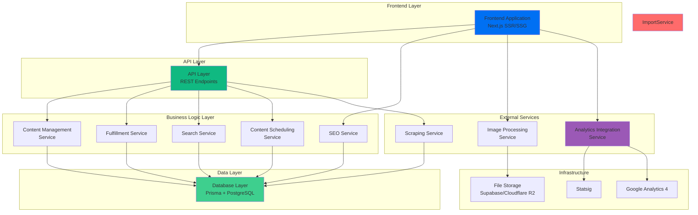

## External APIs

### Amazon.com.au API

- **Purpose:** Dropshipping product integration for Phase 1a. Enables order forwarding and product information retrieval for dropshipped products.
- **Documentation:** [Amazon Product Advertising API](https://webservices.amazon.com/paapi5/documentation/) or [Amazon Marketplace Web Service](https://developer.amazon.com/mws)
- **Base URL(s):** Varies by API version and region (Australia: `webservices.amazon.com.au`)
- **Authentication:** AWS Signature Version 4, requires Access Key ID and Secret Access Key
- **Rate Limits:** Varies by API (typically 1 request per second, with burst capacity)

**Key Endpoints Used:**
- `POST /paapi5/searchitems` - Search for products by keyword/ASIN
- `POST /paapi5/getitems` - Get detailed product information
- `POST /paapi5/getbrowsenodes` - Browse product categories
- Order placement endpoints (via MWS or Seller Central API)

**Integration Notes:**
- Requires Amazon Associates or Seller account
- API access may require approval process
- Product data includes: ASIN, title, price, images, availability, ratings
- Order forwarding requires Seller Central API access
- Consider caching product data to reduce API calls
- Handle API errors gracefully (products may become unavailable)

### Statsig API (via MCP)

- **Purpose:** Automated experimentation and feature flag management. Enables agents to create A/B tests, manage feature flags, and analyze experiment results.
- **Documentation:** [Statsig Documentation](https://docs.statsig.com/) and MCP connector documentation
- **Base URL(s):** `https://api.statsig.com` (via MCP connector)
- **Authentication:** API Key via MCP connector (handled by MCP infrastructure)
- **Rate Limits:** Managed by MCP connector, typically generous limits for agent operations

**Key Endpoints Used:**
- Feature flag evaluation (via MCP)
- Experiment creation and management (via MCP)
- Event tracking for A/B test analysis (via MCP)
- Experiment results retrieval (via MCP)

**Integration Notes:**
- Access via MCP connector enables agent-driven experimentation
- Agents can create experiments for content variations (headlines, descriptions, CTAs)
- Experiment results feed back into content optimization workflows
- Feature flags can control content rollout (gradual publishing, A/B testing)
- Integration with Google Analytics for comprehensive experiment analysis

### Google Analytics 4 API (via MCP)

- **Purpose:** User behavior tracking, SEO performance monitoring, and data-driven content optimization. Enables agents to access analytics data and feed insights back into content generation.
- **Documentation:** [Google Analytics Data API](https://developers.google.com/analytics/devguides/reporting/data/v1) and MCP connector documentation
- **Base URL(s):** `https://analyticsdata.googleapis.com` (via MCP connector)
- **Authentication:** OAuth 2.0 via MCP connector (handled by MCP infrastructure)
- **Rate Limits:** 10 requests per second per project (via MCP connector)

**Key Endpoints Used:**
- `POST /v1beta/{property=properties/*}:runReport` - Get page views, user engagement metrics
- `POST /v1beta/{property=properties/*}:runRealtimeReport` - Real-time analytics data
- Search query performance data (via GA4 interface)
- Content performance metrics (page views, bounce rate, time on page)
- SEO ranking data (if integrated with Search Console)

**Integration Notes:**
- Access via MCP connector enables agent-driven analytics
- Agents can query analytics data to identify high-performing content
- Data feeds back into content generation (prioritize successful content patterns)
- Track content velocity impact (correlation between content publishing and traffic)
- Monitor SEO performance (keyword rankings, organic traffic)
- Identify content gaps (zero-result searches, high exit rates)

### Supabase API

- **Purpose:** Managed PostgreSQL database and file storage. Provides database access, authentication, and storage services.
- **Documentation:** [Supabase Documentation](https://supabase.com/docs)
- **Base URL(s):** Project-specific (`https://{project-ref}.supabase.co`)
- **Authentication:** Service Role Key (for server-side) or Anon Key (for client-side)
- **Rate Limits:** Varies by plan (Free tier: 500 requests/second, Pro: higher limits)

**Key Endpoints Used:**
- PostgreSQL database access via Prisma (not direct REST API)
- Storage API (`/storage/v1/object/*`) - Image upload/download
- Auth API (`/auth/v1/*`) - User authentication (Phase 2)

**Integration Notes:**
- Primary database access via Prisma ORM (not direct REST API)
- Storage API used for product images and digital goods
- Connection pooling handled by Supabase
- Automatic backups and point-in-time recovery
- Consider Australian region for lower latency

### Proxy/VPN Service (Australian IP)

- **Purpose:** Provides Australian IP addresses for accessing plantmark.com.au, which blocks international access.
- **Documentation:** Provider-specific (e.g., Bright Data, Oxylabs, or custom VPN solution)
- **Base URL(s):** Provider-specific proxy endpoints
- **Authentication:** API key or credentials (provider-specific)
- **Rate Limits:** Provider-specific (typically generous for scraping use cases)

**Key Endpoints Used:**
- Proxy endpoint configuration
- IP rotation (if supported)
- Geographic targeting (Australian IP addresses)

**Integration Notes:**
- **May not be needed** if Plantmark API is accessible without geographic restrictions
- Required only if Plantmark API requires Australian IP or if using scraping fallback
- Can use dedicated proxy service or VPN solution
- Consider cost implications (proxy services charge per GB or per IP)
- Implement IP rotation if available to avoid detection
- Monitor proxy health and switch providers if needed
- Respect rate limiting (1 request per 2 seconds as per NFR4 for scraping)

### Plantmark API (Preferred) / Web Scraping (Fallback)

- **Purpose:** Source for physical plant/tree product data. **PREFERRED:** Use Plantmark's internal API if available. **FALLBACK:** Web scraping if API is not accessible or requires authentication.
- **Documentation:** 
  - **API:** To be determined from network inspection (check network tab for API endpoints)
  - **Scraping:** N/A (fallback method)
- **Base URL(s):** 
  - **API:** To be determined (likely `https://www.plantmark.com.au/api/*` or similar)
  - **Scraping:** `https://www.plantmark.com.au`
- **Authentication:** 
  - **API:** To be determined (may require API key, session token, or be public)
  - **Scraping:** N/A (public website, but requires Australian IP)
- **Rate Limits:** 
  - **API:** To be determined (likely more generous than scraping)
  - **Scraping:** Must respect robots.txt and implement 1 request per 2 seconds minimum (NFR4)

**Key Endpoints Used (API - Preferred):**
- Product listing endpoint (to be identified from network tab)
- Product detail endpoint (to be identified from network tab)
- Category/filter endpoint (to be identified from network tab)
- Search endpoint (to be identified from network tab)

**Key Endpoints Used (Scraping - Fallback):**
- Product listing pages (scraped)
- Product detail pages (scraped)
- Category pages (scraped)
- Search results pages (scraped)

**Integration Notes:**
- **PREFERRED APPROACH:** Investigate Plantmark's internal API by inspecting network requests on their website
  - Check network tab for XHR/Fetch requests when browsing products
  - Look for JSON responses containing product data
  - Identify API endpoint patterns (likely REST or GraphQL)
  - Determine authentication requirements (if any)
  - API approach is more reliable, efficient, and maintainable than scraping
  - May still require Australian IP address
- **FALLBACK APPROACH:** Web scraping if API is not accessible
  - Requires web scraping with Puppeteer/Playwright
  - Must respect robots.txt and rate limiting
  - Requires Australian IP address (via proxy/VPN)
  - Website structure may change - implement robust error handling
  - Extract: product name, description, images, price, availability, category, botanical name
  - Handle pagination and dynamic content loading
  - Implement incremental updates (only scrape changed products)
- **Legal/ethical considerations:** 
  - API: If public API, likely more acceptable than scraping
  - Scraping: Ensure scraping is permissible, respect terms of service
  - Consider reaching out to Plantmark for official API access or partnership

### Cloudflare R2 / AWS S3 (Image Storage)

- **Purpose:** Object storage for product images and digital assets with CDN integration.
- **Documentation:** 
  - [Cloudflare R2](https://developers.cloudflare.com/r2/)
  - [AWS S3](https://docs.aws.amazon.com/s3/)
- **Base URL(s):** 
  - R2: Custom domain or `{account-id}.r2.cloudflarestorage.com`
  - S3: `https://s3.{region}.amazonaws.com/{bucket-name}`
- **Authentication:** Access Key ID and Secret Access Key (or IAM roles)
- **Rate Limits:** Very high (thousands of requests per second)

**Key Endpoints Used:**
- `PUT /{object-key}` - Upload images
- `GET /{object-key}` - Retrieve images
- `DELETE /{object-key}` - Delete images
- CDN integration for fast global delivery

**Integration Notes:**
- Used for product images and digital goods storage
- CDN integration for fast image delivery
- Consider Cloudflare R2 for zero egress fees
- Image optimization pipeline (resize, compress, WebP conversion)
- Integration with Next.js Image component
- Cost considerations: Storage costs + CDN bandwidth

## Core Workflows

### Workflow 1: Product Page Rendering (SSR/SSG)

**Purpose:** Illustrates how product pages are rendered with SEO optimization, including data fetching, content enrichment, and structured data injection.

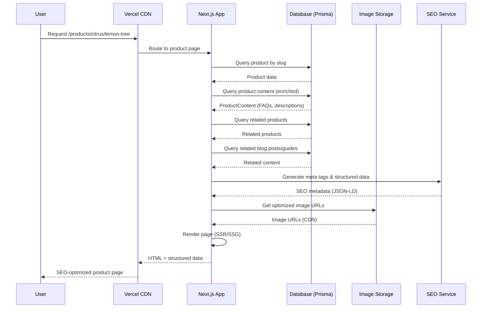

### Workflow 2: Product Data Import (Plantmark API Preferred)

**Purpose:** Shows the product import workflow using Plantmark API (preferred) or scraping (fallback), including data processing, validation, and storage.

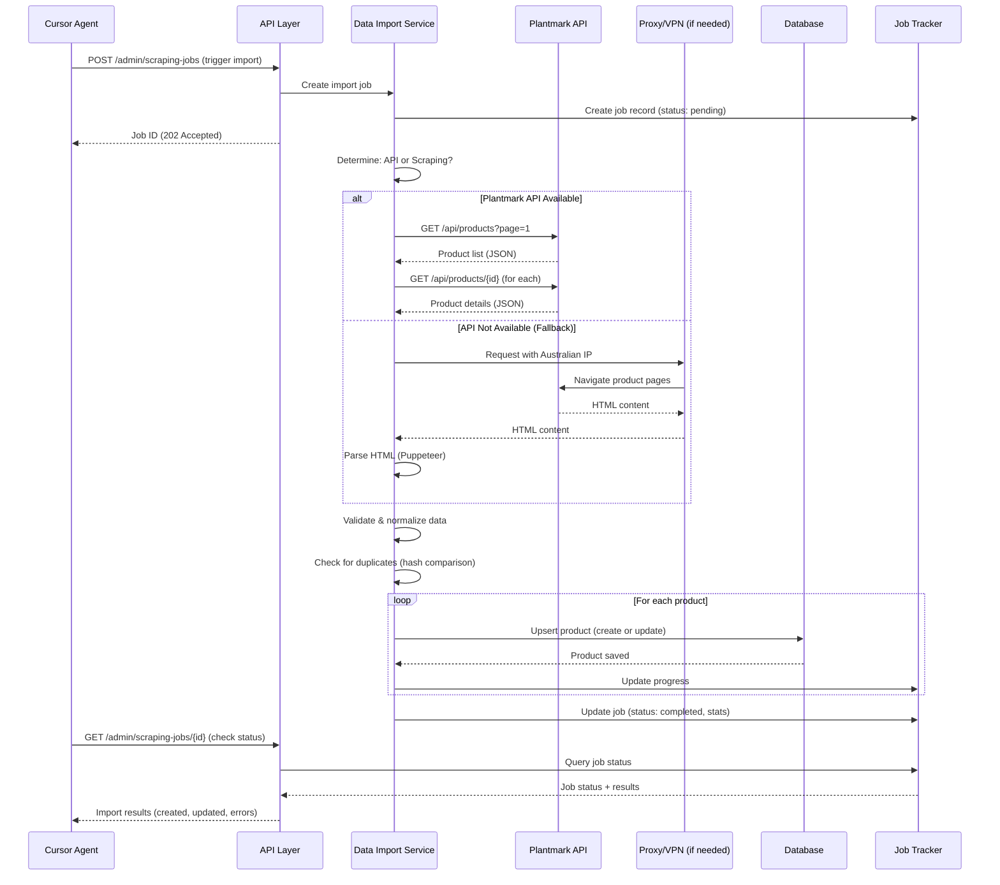

### Workflow 3: Agent-Driven Content Generation

**Purpose:** Illustrates how agents generate and publish content through the API, including content validation, quality checks, and publishing workflows.

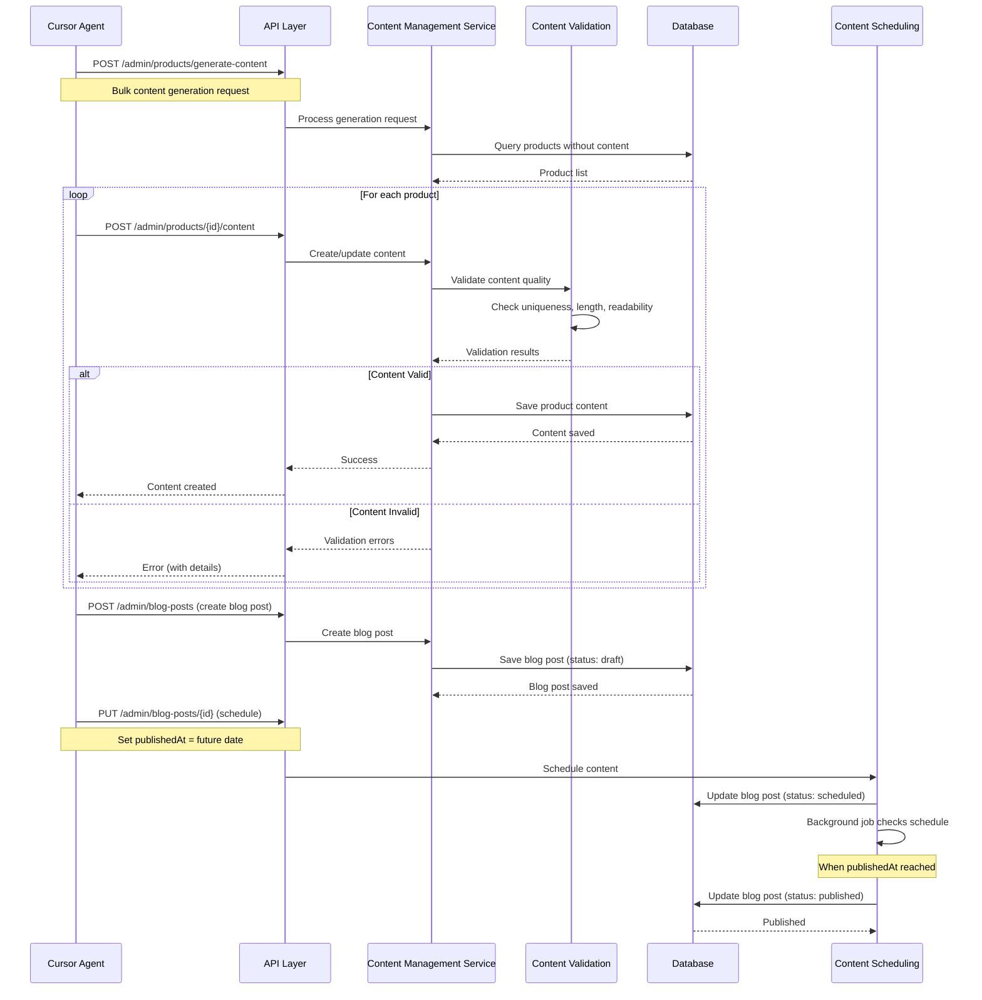

### Workflow 4: Search and Discovery

**Purpose:** Shows the search workflow including query processing, database search, result ranking, and related content discovery.

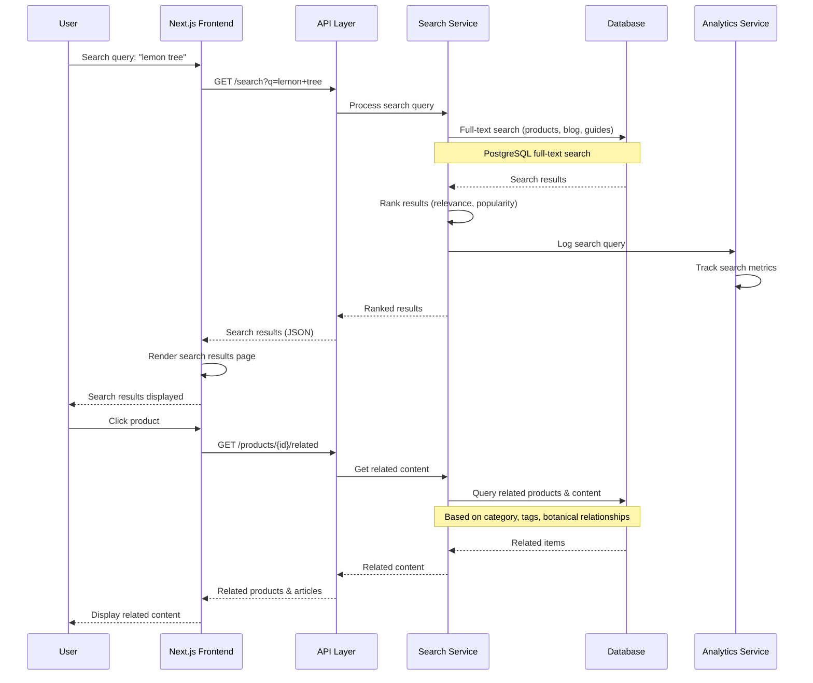

### Workflow 5: Content Freshness Update

**Purpose:** Illustrates the automated content freshness update workflow that maintains SEO signals and content velocity.

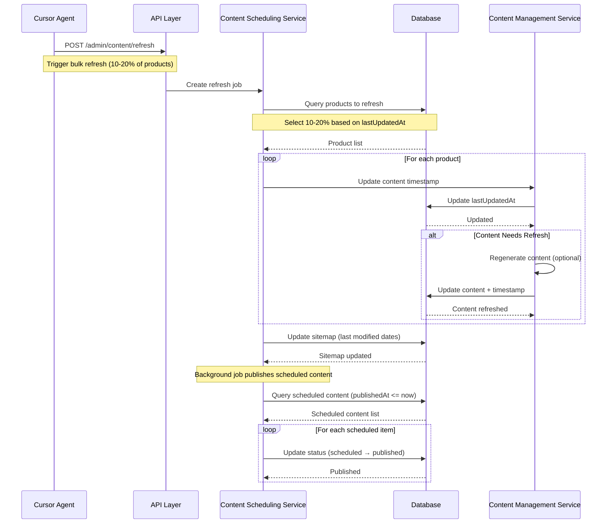

### Workflow 6: Analytics-Driven Content Optimization

**Purpose:** Shows how agents use analytics data (via MCP) to optimize content strategy and run experiments.

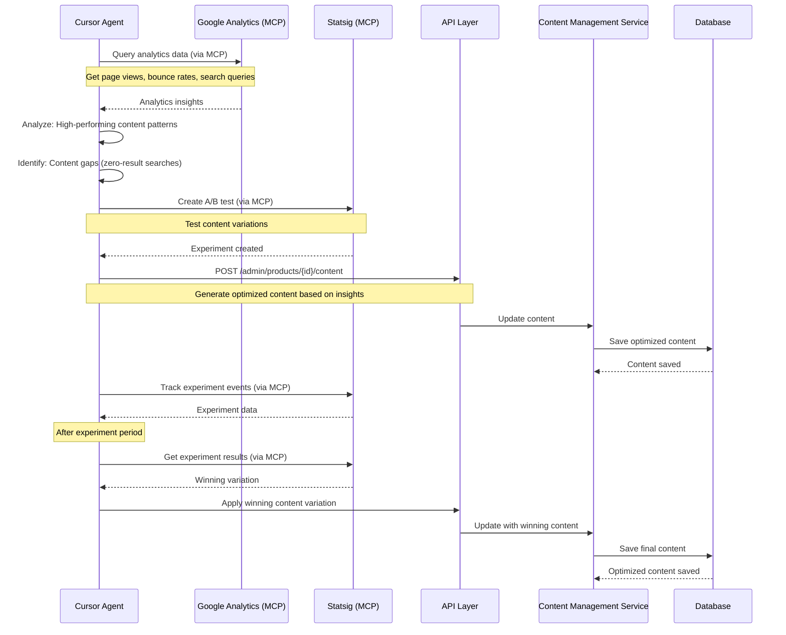

## Database Schema

### Prisma Schema Definition

The database schema is defined using Prisma ORM for type-safe database access. Below is the complete schema definition:

```prisma
// schema.prisma
generator client {
  provider = "prisma-client-js"
}

datasource db {
  provider = "postgresql"
  url      = env("DATABASE_URL")
}

// Enums
enum ProductType {
  DIGITAL
  DROPSHIPPED
  PHYSICAL
  BUNDLE
}

enum AvailabilityStatus {
  IN_STOCK
  OUT_OF_STOCK
  PRE_ORDER
  DISCONTINUED
}

enum ProductSource {
  SCRAPED
  MANUAL
  API
}

enum ContentStatus {
  DRAFT
  SCHEDULED
  PUBLISHED
  ARCHIVED
}

enum GuideType {
  HOW_TO
  CARE
  SEASONAL
  COMPARISON
}

enum LocationType {
  CITY
  REGION
  STATE
  CLIMATE_ZONE
}

enum ScrapingJobType {
  FULL
  INCREMENTAL
}

enum ScrapingJobStatus {
  PENDING
  RUNNING
  COMPLETED
  FAILED
}

// Phase 2 Enums (for future use)
enum OrderStatus {
  PENDING
  PROCESSING
  SHIPPED
  DELIVERED
  CANCELLED
}

enum PaymentStatus {
  PENDING
  PAID
  FAILED
  REFUNDED
}

enum FulfillmentStatus {
  PENDING
  FULFILLED
  CANCELLED
}

// Models
model Product {
  id              String            @id @default(uuid())
  name            String
  slug            String            @unique
  description     String            @db.Text
  productType     ProductType
  price           Decimal           @db.Decimal(10, 2)
  availability    AvailabilityStatus
  categoryId      String
  category        Category          @relation(fields: [categoryId], references: [id])
  botanicalName   String?           @db.VarChar(255)
  commonName      String?           @db.VarChar(255)
  images          String[]          @default([])
  seoMetadata     Json              @default("{}")
  typeSpecificData Json             @default("{}")
  source          ProductSource
  sourceUrl       String?           @db.VarChar(500)
  lastScrapedAt   DateTime?
  createdAt       DateTime          @default(now())
  updatedAt       DateTime          @updatedAt

  // Relations
  content         ProductContent?
  faqs            FAQ[]
  orderItems      OrderItem[]       // Phase 2
  comparisons     ComparisonProduct[]
  relatedBlogPosts BlogPostProduct[]
  relatedGuides   GuideProduct[]
  locationPages   LocationPageProduct[]

  @@index([slug])
  @@index([categoryId])
  @@index([productType])
  @@index([availability])
  @@index([source])
  @@index([lastScrapedAt])
  @@fulltext([name, description, botanicalName, commonName])
}

model Category {
  id              String            @id @default(uuid())
  name            String
  slug            String            @unique
  parentId        String?
  parent          Category?         @relation("CategoryHierarchy", fields: [parentId], references: [id])
  children        Category[]        @relation("CategoryHierarchy")
  description     String            @db.Text
  image           String?           @db.VarChar(500)
  seoMetadata     Json              @default("{}")
  displayOrder    Int               @default(0)
  createdAt       DateTime          @default(now())
  updatedAt       DateTime          @updatedAt

  // Relations
  products        Product[]
  content         CategoryContent?

  @@index([slug])
  @@index([parentId])
  @@index([displayOrder])
}

model ProductContent {
  id                  String            @id @default(uuid())
  productId           String            @unique
  product             Product           @relation(fields: [productId], references: [id], onDelete: Cascade)
  detailedDescription String            @db.Text
  growingRequirements Json              @default("{}")
  careInstructions    String            @db.Text
  companionPlants     String[]          @default([])
  lastUpdatedAt       DateTime          @default(now())
  createdAt           DateTime          @default(now())
  updatedAt           DateTime          @updatedAt

  @@index([productId])
  @@index([lastUpdatedAt])
}

model FAQ {
  id          String   @id @default(uuid())
  productId   String
  product     Product  @relation(fields: [productId], references: [id], onDelete: Cascade)
  question    String   @db.Text
  answer      String   @db.Text
  displayOrder Int     @default(0)
  createdAt   DateTime @default(now())
  updatedAt   DateTime @updatedAt

  @@index([productId])
  @@index([displayOrder])
}

model CategoryContent {
  id                String   @id @default(uuid())
  categoryId        String   @unique
  category          Category @relation(fields: [categoryId], references: [id], onDelete: Cascade)
  description       String   @db.Text
  growingTips       String   @db.Text
  seasonalAdvice    Json     @default("{}")
  featuredProductIds String[] @default([])
  lastUpdatedAt     DateTime @default(now())
  createdAt         DateTime @default(now())
  updatedAt         DateTime @updatedAt

  @@index([categoryId])
  @@index([lastUpdatedAt])
}

model BlogPost {
  id                String         @id @default(uuid())
  title             String
  slug              String         @unique
  content           String         @db.Text
  excerpt           String         @db.Text
  author            String
  tags              String[]       @default([])
  categoryIds       String[]       @default([])
  featuredImage     String?        @db.VarChar(500)
  readingTime       Int?
  status            ContentStatus  @default(DRAFT)
  publishedAt       DateTime?
  seoMetadata       Json           @default("{}")
  relatedProductIds String[]       @default([])
  createdAt         DateTime       @default(now())
  updatedAt         DateTime       @updatedAt

  // Relations
  relatedProducts   BlogPostProduct[]

  @@index([slug])
  @@index([status])
  @@index([publishedAt])
  @@index([author])
  @@fulltext([title, content, excerpt])
}

model Guide {
  id                String         @id @default(uuid())
  title             String
  slug              String         @unique
  content           String         @db.Text
  excerpt           String         @db.Text
  guideType         GuideType
  author            String
  tags              String[]       @default([])
  featuredImage     String?        @db.VarChar(500)
  relatedProductIds String[]       @default([])
  status            ContentStatus  @default(DRAFT)
  publishedAt       DateTime?
  seoMetadata       Json           @default("{}")
  createdAt         DateTime       @default(now())
  updatedAt         DateTime       @updatedAt

  // Relations
  relatedProducts   GuideProduct[]

  @@index([slug])
  @@index([guideType])
  @@index([status])
  @@index([publishedAt])
  @@fulltext([title, content, excerpt])
}

model Comparison {
  id              String         @id @default(uuid())
  title           String
  slug            String         @unique
  productIds      String[]       @default([])
  comparisonData  Json           @default("{}")
  recommendation  String         @db.Text
  status          ContentStatus  @default(DRAFT)
  publishedAt     DateTime?
  seoMetadata     Json           @default("{}")
  createdAt       DateTime       @default(now())
  updatedAt       DateTime       @updatedAt

  // Relations
  products        ComparisonProduct[]

  @@index([slug])
  @@index([status])
  @@index([publishedAt])
}

model ComparisonProduct {
  id            String      @id @default(uuid())
  comparisonId  String
  comparison    Comparison  @relation(fields: [comparisonId], references: [id], onDelete: Cascade)
  productId     String
  product       Product     @relation(fields: [productId], references: [id], onDelete: Cascade)

  @@unique([comparisonId, productId])
  @@index([comparisonId])
  @@index([productId])
}

model BlogPostProduct {
  id          String    @id @default(uuid())
  blogPostId  String
  blogPost    BlogPost  @relation(fields: [blogPostId], references: [id], onDelete: Cascade)
  productId   String
  product     Product   @relation(fields: [productId], references: [id], onDelete: Cascade)

  @@unique([blogPostId, productId])
  @@index([blogPostId])
  @@index([productId])
}

model GuideProduct {
  id        String  @id @default(uuid())
  guideId   String
  guide     Guide   @relation(fields: [guideId], references: [id], onDelete: Cascade)
  productId String
  product   Product @relation(fields: [productId], references: [id], onDelete: Cascade)

  @@unique([guideId, productId])
  @@index([guideId])
  @@index([productId])
}

model LocationPage {
  id            String         @id @default(uuid())
  title         String
  slug          String         @unique
  location      String
  locationType  LocationType
  content       String         @db.Text
  climateInfo   Json           @default("{}")
  productIds    String[]       @default([])
  status        ContentStatus  @default(DRAFT)
  publishedAt   DateTime?
  seoMetadata   Json           @default("{}")
  createdAt     DateTime       @default(now())
  updatedAt     DateTime       @updatedAt

  // Relations
  products      LocationPageProduct[]

  @@index([slug])
  @@index([location])
  @@index([locationType])
  @@index([status])
  @@index([publishedAt])
  @@fulltext([title, content])
}

model LocationPageProduct {
  id            String        @id @default(uuid())
  locationPageId String
  locationPage  LocationPage @relation(fields: [locationPageId], references: [id], onDelete: Cascade)
  productId     String
  product       Product      @relation(fields: [productId], references: [id], onDelete: Cascade)

  @@unique([locationPageId, productId])
  @@index([locationPageId])
  @@index([productId])
}

model ScrapingJob {
  id                String            @id @default(uuid())
  jobType           ScrapingJobType
  status            ScrapingJobStatus  @default(PENDING)
  startedAt         DateTime?
  completedAt       DateTime?
  productsProcessed Int                @default(0)
  productsCreated   Int                @default(0)
  productsUpdated   Int                @default(0)
  errors            Json               @default("[]")
  metadata          Json               @default("{}")
  createdAt         DateTime           @default(now())
  updatedAt         DateTime           @updatedAt

  @@index([status])
  @@index([jobType])
  @@index([createdAt])
}

// Phase 2 Models (for future implementation)
model Order {
  id              String          @id @default(uuid())
  orderNumber     String          @unique
  customerEmail   String
  customerName    String
  shippingAddress Json
  status          OrderStatus     @default(PENDING)
  fulfillmentType String          // 'digital' | 'dropship' | 'inventory'
  totalAmount     Decimal         @db.Decimal(10, 2)
  paymentStatus   PaymentStatus   @default(PENDING)
  paymentMethod   String?
  createdAt       DateTime        @default(now())
  updatedAt       DateTime        @updatedAt

  // Relations
  items           OrderItem[]

  @@index([orderNumber])
  @@index([customerEmail])
  @@index([status])
  @@index([createdAt])
}

model OrderItem {
  id                String            @id @default(uuid())
  orderId           String
  order             Order             @relation(fields: [orderId], references: [id], onDelete: Cascade)
  productId         String
  product           Product           @relation(fields: [productId], references: [id])
  quantity          Int
  price             Decimal           @db.Decimal(10, 2)
  fulfillmentStatus FulfillmentStatus @default(PENDING)
  createdAt         DateTime          @default(now())
  updatedAt         DateTime          @updatedAt

  @@index([orderId])
  @@index([productId])
}
```

### Schema Design Decisions

**Indexes:**
- **Slug indexes:** All content entities (Product, Category, BlogPost, Guide, etc.) have unique slug indexes for fast URL lookups
- **Foreign key indexes:** All foreign keys are indexed for join performance
- **Status indexes:** Content status fields indexed for filtering published/draft content
- **Full-text search indexes:** Product, BlogPost, Guide, and LocationPage have full-text indexes on searchable fields
- **Composite indexes:** Junction tables (ComparisonProduct, BlogPostProduct, etc.) have composite unique constraints

**Data Types:**
- **JSON fields:** Used for flexible schema (seoMetadata, typeSpecificData, growingRequirements, etc.)
- **Arrays:** PostgreSQL native array support for tags, images, productIds
- **Decimal:** Used for prices to avoid floating-point precision issues
- **Text:** Used for long-form content (descriptions, content fields)

**Relationships:**
- **Cascade deletes:** Content relationships cascade delete (e.g., deleting Product deletes ProductContent and FAQs)
- **Optional relationships:** Some relationships are optional (e.g., CategoryContent, ProductContent)
- **Many-to-many:** Implemented via junction tables (ComparisonProduct, BlogPostProduct, etc.) for proper normalization

**Performance Considerations:**
- Full-text search indexes on frequently searched fields
- Indexes on frequently filtered fields (status, publishedAt, categoryId)
- JSON fields for flexible data without additional tables
- Array fields for simple lists (tags, images) to avoid junction tables

**Scalability:**
- UUID primary keys for distributed systems
- Timestamps for all entities (createdAt, updatedAt)
- Indexed foreign keys for efficient joins
- Full-text search ready for thousands of products

## Frontend Architecture

### Component Architecture

#### Component Organization

```
apps/web/
├── src/
│   ├── app/                          # Next.js App Router
│   │   ├── (marketing)/              # Marketing route group
│   │   │   ├── page.tsx              # Homepage
│   │   │   ├── layout.tsx            # Marketing layout
│   │   │   └── about/
│   │   ├── products/
│   │   │   └── [category]/
│   │   │       └── [slug]/
│   │   │           └── page.tsx      # Product detail page
│   │   ├── categories/
│   │   │   └── [slug]/
│   │   │       └── page.tsx          # Category listing page
│   │   ├── blog/
│   │   │   ├── page.tsx              # Blog listing
│   │   │   └── [slug]/
│   │   │       └── page.tsx          # Blog post page
│   │   ├── guides/
│   │   │   ├── page.tsx              # Guide listing
│   │   │   └── [slug]/
│   │   │       └── page.tsx          # Guide page
│   │   ├── compare/
│   │   │   └── [slug]/
│   │   │       └── page.tsx          # Comparison page
│   │   ├── locations/
│   │   │   └── [slug]/
│   │   │       └── page.tsx          # Location page
│   │   ├── search/
│   │   │   └── page.tsx              # Search results
│   │   ├── api/                      # API routes
│   │   │   ├── products/
│   │   │   ├── categories/
│   │   │   ├── search/
│   │   │   └── admin/
│   │   ├── layout.tsx                # Root layout
│   │   └── globals.css               # Global styles
│   ├── components/                   # React components
│   │   ├── ui/                       # shadcn/ui components
│   │   │   ├── button.tsx
│   │   │   ├── card.tsx
│   │   │   ├── input.tsx
│   │   │   └── ...
│   │   ├── layout/                   # Layout components
│   │   │   ├── Header.tsx
│   │   │   ├── Footer.tsx
│   │   │   ├── Navigation.tsx
│   │   │   └── Breadcrumbs.tsx
│   │   ├── product/                  # Product-specific components
│   │   │   ├── ProductCard.tsx
│   │   │   ├── ProductDetail.tsx
│   │   │   ├── ProductImage.tsx
│   │   │   ├── ProductFAQ.tsx
│   │   │   └── RelatedProducts.tsx
│   │   ├── category/                 # Category components
│   │   │   ├── CategoryCard.tsx
│   │   │   ├── CategoryFilter.tsx
│   │   │   └── CategoryGrid.tsx
│   │   ├── content/                  # Content components
│   │   │   ├── BlogCard.tsx
│   │   │   ├── GuideCard.tsx
│   │   │   ├── ComparisonTable.tsx
│   │   │   └── RichText.tsx
│   │   ├── search/                   # Search components
│   │   │   ├── SearchBar.tsx
│   │   │   ├── SearchResults.tsx
│   │   │   └── SearchFilters.tsx
│   │   └── seo/                      # SEO components
│   │       ├── StructuredData.tsx
│   │       └── MetaTags.tsx
│   ├── lib/                          # Utilities and helpers
│   │   ├── api/                      # API client
│   │   │   ├── client.ts
│   │   │   ├── products.ts
│   │   │   ├── categories.ts
│   │   │   └── search.ts
│   │   ├── utils/                    # Utility functions
│   │   │   ├── cn.ts                 # className utility
│   │   │   ├── format.ts             # Formatting utilities
│   │   │   └── seo.ts                # SEO helpers
│   │   └── db/                       # Database client (Prisma)
│   │       └── client.ts
│   ├── hooks/                        # Custom React hooks
│   │   ├── useSearch.ts
│   │   ├── useProducts.ts
│   │   └── useDebounce.ts
│   ├── types/                        # TypeScript types
│   │   ├── product.ts
│   │   ├── category.ts
│   │   └── api.ts
│   └── styles/                       # Additional styles
│       └── components.css
├── public/                           # Static assets
│   ├── images/
│   └── favicon.ico
└── package.json
```

#### Component Template

**Server Component Example (Product Page):**

```typescript
// app/products/[category]/[slug]/page.tsx
import { Metadata } from 'next';
import { notFound } from 'next/navigation';
import { prisma } from '@/lib/db/client';
import { ProductDetail } from '@/components/product/ProductDetail';
import { RelatedProducts } from '@/components/product/RelatedProducts';
import { StructuredData } from '@/components/seo/StructuredData';
import { generateProductMetadata } from '@/lib/utils/seo';

interface PageProps {
  params: {
    category: string;
    slug: string;
  };
}

// Generate metadata for SEO
export async function generateMetadata({ params }: PageProps): Promise<Metadata> {
  const product = await prisma.product.findUnique({
    where: { slug: params.slug },
    include: { category: true, content: true },
  });

  if (!product) return {};

  return generateProductMetadata(product);
}

// Server Component - data fetching at request time
export default async function ProductPage({ params }: PageProps) {
  const product = await prisma.product.findUnique({
    where: { slug: params.slug },
    include: {
      category: true,
      content: true,
      faqs: {
        orderBy: { displayOrder: 'asc' },
      },
    },
  });

  if (!product) {
    notFound();
  }

  // Fetch related products
  const relatedProducts = await prisma.product.findMany({
    where: {
      categoryId: product.categoryId,
      id: { not: product.id },
    },
    take: 6,
  });

  return (
    <>
      <StructuredData type="product" data={product} />
      <ProductDetail product={product} />
      <RelatedProducts products={relatedProducts} />
    </>
  );
}
```

**Client Component Example (Search Bar):**

```typescript
// components/search/SearchBar.tsx
'use client';

import { useState } from 'react';
import { useRouter } from 'next/navigation';
import { useDebounce } from '@/hooks/useDebounce';
import { Input } from '@/components/ui/input';
import { Search } from 'lucide-react';

export function SearchBar() {
  const [query, setQuery] = useState('');
  const router = useRouter();
  const debouncedQuery = useDebounce(query, 300);

  const handleSubmit = (e: React.FormEvent) => {
    e.preventDefault();
    if (query.trim()) {
      router.push(`/search?q=${encodeURIComponent(query)}`);
    }
  };

  return (
    <form onSubmit={handleSubmit} className="relative">
      <Input
        type="search"
        placeholder="Search products..."
        value={query}
        onChange={(e) => setQuery(e.target.value)}
        className="pl-10"
      />
      <Search className="absolute left-3 top-1/2 -translate-y-1/2 h-4 w-4 text-muted-foreground" />
    </form>
  );
}
```

### State Management Architecture

#### State Structure

Next.js App Router uses React Server Components by default, minimizing client-side state needs. State management follows this hierarchy:

**Server State (Server Components):**
- Product data
- Category data
- Blog posts and guides
- All content data

**Client State (Client Components):**
- Search query
- Filter selections
- UI state (modals, dropdowns, accordions)
- Form state

**Shared State (React Context - Minimal):**
- User preferences (theme, if needed)
- Cart state (Phase 2)

```typescript
// lib/context/AppContext.tsx (if needed)
'use client';

import { createContext, useContext, useState, ReactNode } from 'react';

interface AppContextType {
  // Minimal client state only
  // Most state handled by Server Components
}

const AppContext = createContext<AppContextType | undefined>(undefined);

export function AppProvider({ children }: { children: ReactNode }) {
  // Minimal state management
  return <AppContext.Provider value={{}}>{children}</AppContext.Provider>;
}

export function useApp() {
  const context = useContext(AppContext);
  if (!context) {
    throw new Error('useApp must be used within AppProvider');
  }
  return context;
}
```

#### State Management Patterns

- **Server Components First:** Use Server Components for all data fetching - no client-side API calls for initial data
- **Client Components for Interactivity:** Only use Client Components (`'use client'`) for interactive features (search, filters, forms)
- **React Context for Shared State:** Minimal use of Context - only for truly shared client state (cart, user preferences)
- **URL State for Filters:** Use URL query parameters for filter state (shareable, bookmarkable)
- **Server Actions for Mutations:** Use Server Actions for form submissions and mutations (Phase 2)
- **Optimistic Updates:** Implement optimistic updates for better UX (Phase 2)

### Routing Architecture

#### Route Organization

Next.js App Router file-based routing structure:

```
app/
├── page.tsx                          # Homepage (/)
├── layout.tsx                         # Root layout
├── products/
│   └── [category]/
│       └── [slug]/
│           └── page.tsx              # /products/{category}/{slug}
├── categories/
│   └── [slug]/
│       └── page.tsx                  # /categories/{slug}
├── blog/
│   ├── page.tsx                      # /blog
│   └── [slug]/
│       └── page.tsx                  # /blog/{slug}
├── guides/
│   ├── page.tsx                      # /guides
│   └── [slug]/
│       └── page.tsx                  # /guides/{slug}
├── compare/
│   └── [slug]/
│       └── page.tsx                  # /compare/{slug}
├── locations/
│   └── [slug]/
│       └── page.tsx                  # /locations/{slug}
├── search/
│   └── page.tsx                      # /search?q=query
└── api/                              # API routes
    ├── products/
    ├── categories/
    ├── search/
    └── admin/
```

**Route Patterns:**
- **Dynamic Routes:** `[slug]` for single item pages, `[category]/[slug]` for nested routes
- **Route Groups:** `(marketing)` for grouping routes without affecting URL structure
- **Layouts:** Nested layouts for shared UI (header, footer, navigation)
- **Loading States:** `loading.tsx` files for loading UI
- **Error Boundaries:** `error.tsx` files for error handling
- **Not Found:** `not-found.tsx` for 404 pages

#### Protected Route Pattern

**Note:** Phase 1 has no user authentication. This pattern is for Phase 2.

```typescript
// middleware.ts (Phase 2)
import { NextResponse } from 'next/server';
import type { NextRequest } from 'next/server';

export function middleware(request: NextRequest) {
  // API key validation for admin routes
  if (request.nextUrl.pathname.startsWith('/api/admin')) {
    const apiKey = request.headers.get('X-API-Key');
    if (!apiKey || !isValidApiKey(apiKey)) {
      return NextResponse.json({ error: 'Unauthorized' }, { status: 401 });
    }
  }

  return NextResponse.next();
}

export const config = {
  matcher: '/api/admin/:path*',
};
```

### Frontend Services Layer

#### API Client Setup

```typescript
// lib/api/client.ts
const API_BASE_URL = process.env.NEXT_PUBLIC_API_URL || '/api';

interface ApiClientConfig {
  baseURL?: string;
  headers?: Record<string, string>;
}

class ApiClient {
  private baseURL: string;
  private defaultHeaders: Record<string, string>;

  constructor(config: ApiClientConfig = {}) {
    this.baseURL = config.baseURL || API_BASE_URL;
    this.defaultHeaders = {
      'Content-Type': 'application/json',
      ...config.headers,
    };
  }

  async request<T>(
    endpoint: string,
    options: RequestInit = {}
  ): Promise<T> {
    const url = `${this.baseURL}${endpoint}`;
    const response = await fetch(url, {
      ...options,
      headers: {
        ...this.defaultHeaders,
        ...options.headers,
      },
    });

    if (!response.ok) {
      const error = await response.json().catch(() => ({ message: 'Unknown error' }));
      throw new Error(error.message || `HTTP ${response.status}`);
    }

    return response.json();
  }

  get<T>(endpoint: string, options?: RequestInit): Promise<T> {
    return this.request<T>(endpoint, { ...options, method: 'GET' });
  }

  post<T>(endpoint: string, data?: unknown, options?: RequestInit): Promise<T> {
    return this.request<T>(endpoint, {
      ...options,
      method: 'POST',
      body: JSON.stringify(data),
    });
  }

  put<T>(endpoint: string, data?: unknown, options?: RequestInit): Promise<T> {
    return this.request<T>(endpoint, {
      ...options,
      method: 'PUT',
      body: JSON.stringify(data),
    });
  }

  delete<T>(endpoint: string, options?: RequestInit): Promise<T> {
    return this.request<T>(endpoint, { ...options, method: 'DELETE' });
  }
}

// Admin API client (with API key)
export const adminApiClient = new ApiClient({
  headers: {
    'X-API-Key': process.env.ADMIN_API_KEY || '',
  },
});

// Public API client
export const apiClient = new ApiClient();
```

#### Service Example

```typescript
// lib/api/products.ts
import { apiClient, adminApiClient } from './client';
import type { Product, ProductContent } from '@/types/product';

export const productService = {
  // Public endpoints
  async getProduct(slug: string): Promise<Product> {
    return apiClient.get<Product>(`/products/${slug}`);
  },

  async getProducts(params?: {
    categoryId?: string;
    productType?: string;
    page?: number;
    limit?: number;
  }): Promise<{ data: Product[]; pagination: PaginationMeta }> {
    const searchParams = new URLSearchParams();
    if (params?.categoryId) searchParams.set('categoryId', params.categoryId);
    if (params?.productType) searchParams.set('productType', params.productType);
    if (params?.page) searchParams.set('page', params.page.toString());
    if (params?.limit) searchParams.set('limit', params.limit.toString());

    return apiClient.get(`/products?${searchParams.toString()}`);
  },

  async getRelatedProducts(productId: string): Promise<Product[]> {
    const response = await apiClient.get<{ products: Product[] }>(
      `/products/${productId}/related`
    );
    return response.products;
  },

  // Admin endpoints (agent-accessible)
  async createProduct(data: Omit<Product, 'id' | 'createdAt' | 'updatedAt'>): Promise<Product> {
    return adminApiClient.post<Product>('/admin/products', data);
  },

  async updateProduct(id: string, data: Partial<Product>): Promise<Product> {
    return adminApiClient.put<Product>(`/admin/products/${id}`, data);
  },

  async updateProductContent(
    productId: string,
    content: Omit<ProductContent, 'id' | 'productId' | 'createdAt' | 'updatedAt'>
  ): Promise<ProductContent> {
    return adminApiClient.post<ProductContent>(
      `/admin/products/${productId}/content`,
      content
    );
  },

  async importProducts(products: Product[]): Promise<ImportResult> {
    return adminApiClient.post<ImportResult>('/admin/products/import', { products });
  },
};
```

**Service Pattern:**
- **Separation:** Public vs Admin API clients
- **Type Safety:** Full TypeScript types for requests/responses
- **Error Handling:** Centralized error handling in API client
- **Reusability:** Services can be used in both Server and Client Components
- **Agent-Friendly:** Admin endpoints clearly separated for agent access

## Backend Architecture

### Service Architecture

Since we're using Next.js API Routes deployed on Vercel, the backend follows a serverless architecture pattern. Each API route is a serverless function that handles a specific endpoint.

#### Function Organization

```
app/api/
├── health/
│   └── route.ts                      # GET /api/health
├── products/
│   ├── route.ts                      # GET /api/products
│   └── [id]/
│       ├── route.ts                  # GET /api/products/{id}
│       └── content/
│           └── route.ts              # GET/POST /api/products/{id}/content
├── categories/
│   ├── route.ts                      # GET /api/categories
│   └── [id]/
│       ├── route.ts                  # GET /api/categories/{id}
│       └── content/
│           └── route.ts              # GET/POST /api/categories/{id}/content
├── search/
│   └── route.ts                      # GET /api/search
├── blog-posts/
│   ├── route.ts                      # GET /api/blog-posts
│   └── [slug]/
│       └── route.ts                  # GET /api/blog-posts/{slug}
├── admin/
│   ├── products/
│   │   ├── route.ts                  # POST /api/admin/products
│   │   ├── import/
│   │   │   └── route.ts              # POST /api/admin/products/import
│   │   ├── update-incremental/
│   │   │   └── route.ts              # POST /api/admin/products/update-incremental
│   │   ├── generate-content/
│   │   │   └── route.ts              # POST /api/admin/products/generate-content
│   │   └── bulk-content/
│   │       └── route.ts              # POST /api/admin/products/bulk-content
│   ├── blog-posts/
│   │   ├── route.ts                  # POST /api/admin/blog-posts
│   │   └── [id]/
│   │       └── route.ts              # PUT/DELETE /api/admin/blog-posts/{id}
│   ├── scraping-jobs/
│   │   ├── route.ts                  # GET/POST /api/admin/scraping-jobs
│   │   └── [id]/
│   │       └── route.ts              # GET /api/admin/scraping-jobs/{id}
│   └── analytics/
│       └── search/
│           └── route.ts              # GET /api/admin/analytics/search
└── middleware.ts                     # API key validation middleware
```

#### Function Template

**Standard API Route Handler:**

```typescript
// app/api/products/route.ts
import { NextRequest, NextResponse } from 'next/server';
import { prisma } from '@/lib/db/client';
import { validateApiKey } from '@/lib/middleware/auth';

export async function GET(request: NextRequest) {
  try {
    const { searchParams } = new URL(request.url);
    const categoryId = searchParams.get('categoryId');
    const productType = searchParams.get('productType');
    const page = parseInt(searchParams.get('page') || '1');
    const limit = parseInt(searchParams.get('limit') || '20');

    const where: any = {};
    if (categoryId) where.categoryId = categoryId;
    if (productType) where.productType = productType;

    const [products, total] = await Promise.all([
      prisma.product.findMany({
        where,
        skip: (page - 1) * limit,
        take: limit,
        include: {
          category: true,
        },
        orderBy: {
          createdAt: 'desc',
        },
      }),
      prisma.product.count({ where }),
    ]);

    return NextResponse.json({
      data: products,
      pagination: {
        page,
        limit,
        total,
        totalPages: Math.ceil(total / limit),
      },
    });
  } catch (error) {
    console.error('Error fetching products:', error);
    return NextResponse.json(
      { error: 'Internal server error' },
      { status: 500 }
    );
  }
}
```

**Admin API Route Handler (with authentication):**

```typescript
// app/api/admin/products/route.ts
import { NextRequest, NextResponse } from 'next/server';
import { validateApiKey } from '@/lib/middleware/auth';
import { prisma } from '@/lib/db/client';
import { z } from 'zod';

const createProductSchema = z.object({
  name: z.string().min(1),
  slug: z.string().min(1),
  description: z.string(),
  productType: z.enum(['digital', 'dropshipped', 'physical', 'bundle']),
  price: z.number().positive(),
  availability: z.enum(['in_stock', 'out_of_stock', 'pre_order', 'discontinued']),
  categoryId: z.string().uuid(),
  // ... other fields
});

export async function POST(request: NextRequest) {
  try {
    // Validate API key
    const apiKey = request.headers.get('X-API-Key');
    if (!apiKey || !validateApiKey(apiKey)) {
      return NextResponse.json(
        { error: 'Unauthorized' },
        { status: 401 }
      );
    }

    const body = await request.json();
    const validatedData = createProductSchema.parse(body);

    const product = await prisma.product.create({
      data: validatedData,
      include: {
        category: true,
      },
    });

    return NextResponse.json(product, { status: 201 });
  } catch (error) {
    if (error instanceof z.ZodError) {
      return NextResponse.json(
        { error: 'Validation error', details: error.errors },
        { status: 400 }
      );
    }

    console.error('Error creating product:', error);
    return NextResponse.json(
      { error: 'Internal server error' },
      { status: 500 }
    );
  }
}
```

**Dynamic Route Handler:**

```typescript
// app/api/products/[id]/route.ts
import { NextRequest, NextResponse } from 'next/server';
import { prisma } from '@/lib/db/client';

interface RouteParams {
  params: {
    id: string;
  };
}

export async function GET(
  request: NextRequest,
  { params }: RouteParams
) {
  try {
    const product = await prisma.product.findUnique({
      where: { id: params.id },
      include: {
        category: true,
        content: true,
        faqs: {
          orderBy: { displayOrder: 'asc' },
        },
      },
    });

    if (!product) {
      return NextResponse.json(
        { error: 'Product not found' },
        { status: 404 }
      );
    }

    return NextResponse.json(product);
  } catch (error) {
    console.error('Error fetching product:', error);
    return NextResponse.json(
      { error: 'Internal server error' },
      { status: 500 }
    );
  }
}
```

### Database Architecture

#### Data Access Layer

**Prisma Client Setup:**

```typescript
// lib/db/client.ts
import { PrismaClient } from '@prisma/client';

const globalForPrisma = globalThis as unknown as {
  prisma: PrismaClient | undefined;
};

export const prisma =
  globalForPrisma.prisma ??
  new PrismaClient({
    log: process.env.NODE_ENV === 'development' ? ['query', 'error', 'warn'] : ['error'],
  });

if (process.env.NODE_ENV !== 'production') globalForPrisma.prisma = prisma;
```

**Repository Pattern Example:**

```typescript
// lib/repositories/ProductRepository.ts
import { prisma } from '@/lib/db/client';
import type { Product, Prisma } from '@prisma/client';

export class ProductRepository {
  async findById(id: string): Promise<Product | null> {
    return prisma.product.findUnique({
      where: { id },
      include: {
        category: true,
        content: true,
        faqs: true,
      },
    });
  }

  async findBySlug(slug: string): Promise<Product | null> {
    return prisma.product.findUnique({
      where: { slug },
      include: {
        category: true,
        content: true,
        faqs: true,
      },
    });
  }

  async findMany(options: {
    categoryId?: string;
    productType?: string;
    page?: number;
    limit?: number;
  }): Promise<{ products: Product[]; total: number }> {
    const where: Prisma.ProductWhereInput = {};
    if (options.categoryId) where.categoryId = options.categoryId;
    if (options.productType) where.productType = options.productType;

    const [products, total] = await Promise.all([
      prisma.product.findMany({
        where,
        skip: options.page && options.limit ? (options.page - 1) * options.limit : undefined,
        take: options.limit,
        include: {
          category: true,
        },
        orderBy: { createdAt: 'desc' },
      }),
      prisma.product.count({ where }),
    ]);

    return { products, total };
  }

  async create(data: Prisma.ProductCreateInput): Promise<Product> {
    return prisma.product.create({
      data,
      include: {
        category: true,
      },
    });
  }

  async update(id: string, data: Prisma.ProductUpdateInput): Promise<Product> {
    return prisma.product.update({
      where: { id },
      data,
      include: {
        category: true,
      },
    });
  }

  async delete(id: string): Promise<void> {
    await prisma.product.delete({
      where: { id },
    });
  }

  async search(query: string, limit: number = 20): Promise<Product[]> {
    return prisma.product.findMany({
      where: {
        OR: [
          { name: { contains: query, mode: 'insensitive' } },
          { description: { contains: query, mode: 'insensitive' } },
          { botanicalName: { contains: query, mode: 'insensitive' } },
          { commonName: { contains: query, mode: 'insensitive' } },
        ],
      },
      take: limit,
      include: {
        category: true,
      },
    });
  }
}

export const productRepository = new ProductRepository();
```

**Service Layer Pattern:**

```typescript
// lib/services/ProductService.ts
import { productRepository } from '@/lib/repositories/ProductRepository';
import { contentValidationService } from './ContentValidationService';
import type { Product, ProductContent } from '@prisma/client';

export class ProductService {
  async getProduct(slug: string): Promise<Product | null> {
    return productRepository.findBySlug(slug);
  }

  async getProducts(filters: {
    categoryId?: string;
    productType?: string;
    page?: number;
    limit?: number;
  }) {
    return productRepository.findMany(filters);
  }

  async createProduct(data: {
    name: string;
    slug: string;
    description: string;
    productType: string;
    price: number;
    categoryId: string;
    // ... other fields
  }): Promise<Product> {
    // Business logic validation
    // ...
    return productRepository.create(data);
  }

  async updateProductContent(
    productId: string,
    content: Omit<ProductContent, 'id' | 'productId' | 'createdAt' | 'updatedAt'>
  ): Promise<ProductContent> {
    // Validate content quality
    const validation = await contentValidationService.validate(content);
    if (!validation.isValid) {
      throw new Error(`Content validation failed: ${validation.errors.join(', ')}`);
    }

    // Update or create content
    return prisma.productContent.upsert({
      where: { productId },
      update: {
        ...content,
        lastUpdatedAt: new Date(),
      },
      create: {
        productId,
        ...content,
        lastUpdatedAt: new Date(),
      },
    });
  }

  async importProducts(products: Product[]): Promise<{
    created: number;
    updated: number;
    errors: Array<{ product: string; error: string }>;
  }> {
    const results = {
      created: 0,
      updated: 0,
      errors: [] as Array<{ product: string; error: string }>,
    };

    for (const product of products) {
      try {
        const existing = await productRepository.findBySlug(product.slug);
        if (existing) {
          await productRepository.update(existing.id, product);
          results.updated++;
        } else {
          await productRepository.create(product);
          results.created++;
        }
      } catch (error) {
        results.errors.push({
          product: product.slug,
          error: error instanceof Error ? error.message : 'Unknown error',
        });
      }
    }

    return results;
  }
}

export const productService = new ProductService();
```

### Authentication and Authorization

#### Auth Flow

**Phase 1: API Key Authentication (Agent Access)**

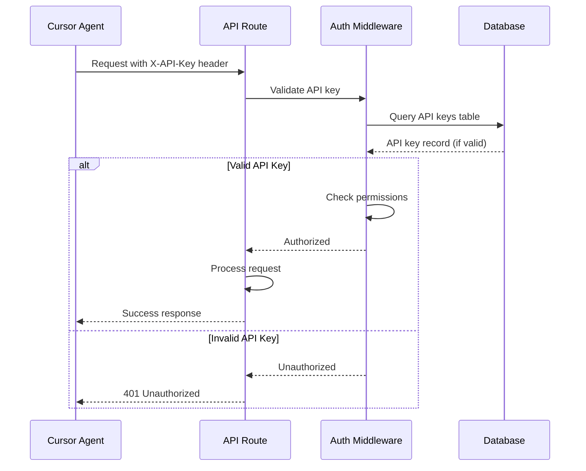

**Phase 2: User Authentication (Future)**

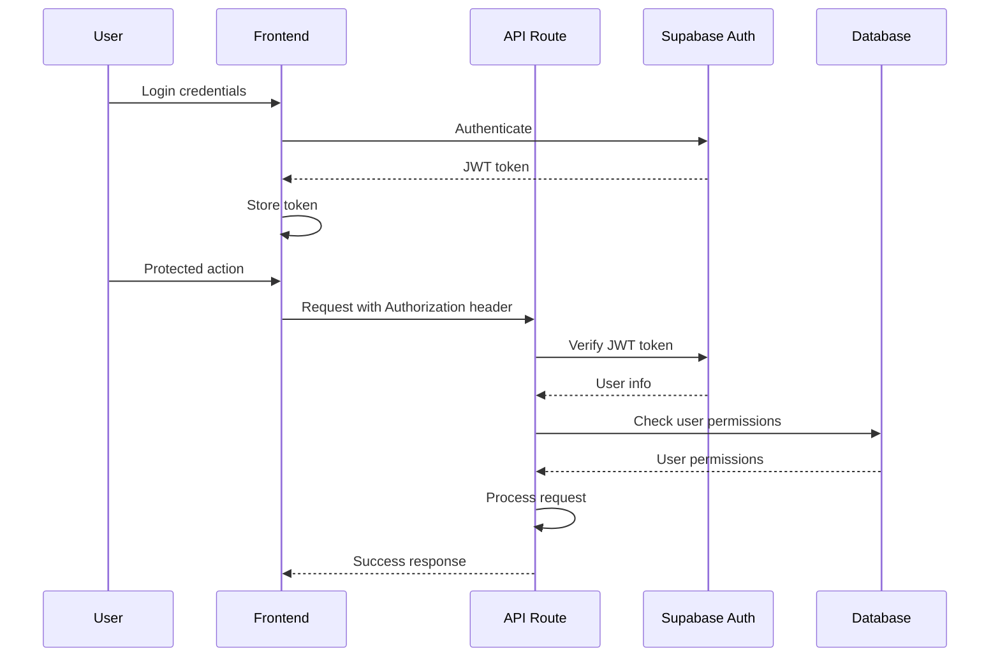

#### Middleware/Guards

**API Key Validation Middleware:**

```typescript
// lib/middleware/auth.ts
import { NextRequest, NextResponse } from 'next/server';
import { prisma } from '@/lib/db/client';

interface ApiKeyRecord {
  id: string;
  key: string;
  name: string;
  permissions: string[];
  isActive: boolean;
  expiresAt: Date | null;
}

export async function validateApiKey(apiKey: string): Promise<boolean> {
  if (!apiKey) return false;

  // In production, hash API keys and compare hashes
  const keyRecord = await prisma.apiKey.findUnique({
    where: { key: apiKey },
  });

  if (!keyRecord || !keyRecord.isActive) {
    return false;
  }

  if (keyRecord.expiresAt && keyRecord.expiresAt < new Date()) {
    return false;
  }

  return true;
}

export function withAuth(
  handler: (request: NextRequest) => Promise<NextResponse>
) {
  return async (request: NextRequest) => {
    const apiKey = request.headers.get('X-API-Key');
    
    if (!apiKey || !(await validateApiKey(apiKey))) {
      return NextResponse.json(
        { error: 'Unauthorized', message: 'Invalid or missing API key' },
        { status: 401 }
      );
    }

    return handler(request);
  };
}
```

**Usage in API Routes:**

```typescript
// app/api/admin/products/route.ts
import { NextRequest, NextResponse } from 'next/server';
import { withAuth } from '@/lib/middleware/auth';
import { productService } from '@/lib/services/ProductService';

async function handler(request: NextRequest) {
  if (request.method === 'POST') {
    const body = await request.json();
    const product = await productService.createProduct(body);
    return NextResponse.json(product, { status: 201 });
  }

  return NextResponse.json({ error: 'Method not allowed' }, { status: 405 });
}

export const POST = withAuth(handler);
```

**Next.js Middleware (Route-level protection):**

```typescript
// middleware.ts
import { NextResponse } from 'next/server';
import type { NextRequest } from 'next/server';
import { validateApiKey } from '@/lib/middleware/auth';

export async function middleware(request: NextRequest) {
  // Protect admin API routes
  if (request.nextUrl.pathname.startsWith('/api/admin')) {
    const apiKey = request.headers.get('X-API-Key');
    
    if (!apiKey || !(await validateApiKey(apiKey))) {
      return NextResponse.json(
        { error: 'Unauthorized' },
        { status: 401 }
      );
    }
  }

  return NextResponse.next();
}

export const config = {
  matcher: '/api/admin/:path*',
};
```

## Agent-Driven Automation & Continuous Improvement

This section defines the architecture for agent-driven automation, scheduled tasks, and continuous improvement workflows that enable BMAD product owner agents to iteratively optimize the product using data from Statsig and Google Analytics.

### Overview

The system is designed to operate autonomously through Cursor Cloud agents, with BMAD product owner agents continuously analyzing performance data, running experiments, and optimizing content based on real user behavior and SEO performance metrics.

**Key Principles:**
- **Data-Driven Decisions:** All optimization decisions are based on analytics and experimentation data
- **Continuous Iteration:** Agents run scheduled tasks to analyze, experiment, and improve content
- **Automated Experimentation:** Statsig integration enables agents to create and manage A/B tests automatically
- **Performance Monitoring:** Google Analytics 4 provides real-time and historical performance data
- **BMAD Agent Orchestration:** Product owner agents coordinate optimization workflows using BMAD methodologies

### Agent Automation Architecture

#### Agent Types and Responsibilities

**1. BMAD Product Owner Agent**
- **Primary Role:** Strategic decision-making and workflow orchestration
- **Responsibilities:**
  - Analyze analytics data from GA4 and Statsig
  - Identify optimization opportunities (content gaps, low-performing pages, high bounce rates)
  - Create and manage experimentation strategies
  - Coordinate content generation and optimization workflows
  - Make data-driven decisions about content strategy
  - Schedule and trigger optimization tasks

**2. Content Generation Agent**
- **Primary Role:** Generate and optimize content based on product owner directives
- **Responsibilities:**
  - Generate SEO-optimized product descriptions
  - Create blog posts and guides
  - Optimize existing content based on performance data
  - Implement winning experiment variations
  - Maintain content freshness and quality

**3. Data Import Agent**
- **Primary Role:** Import and update product data
- **Responsibilities:**
  - Scrape or import product data from plantmark.com.au
  - Update product inventory and pricing
  - Maintain data quality and consistency
  - Handle incremental updates

**4. Analytics Agent**
- **Primary Role:** Monitor and analyze performance metrics
- **Responsibilities:**
  - Query GA4 for performance metrics
  - Retrieve Statsig experiment results
  - Generate performance reports
  - Identify trends and anomalies
  - Feed insights back to product owner agent

#### Agent Communication Pattern

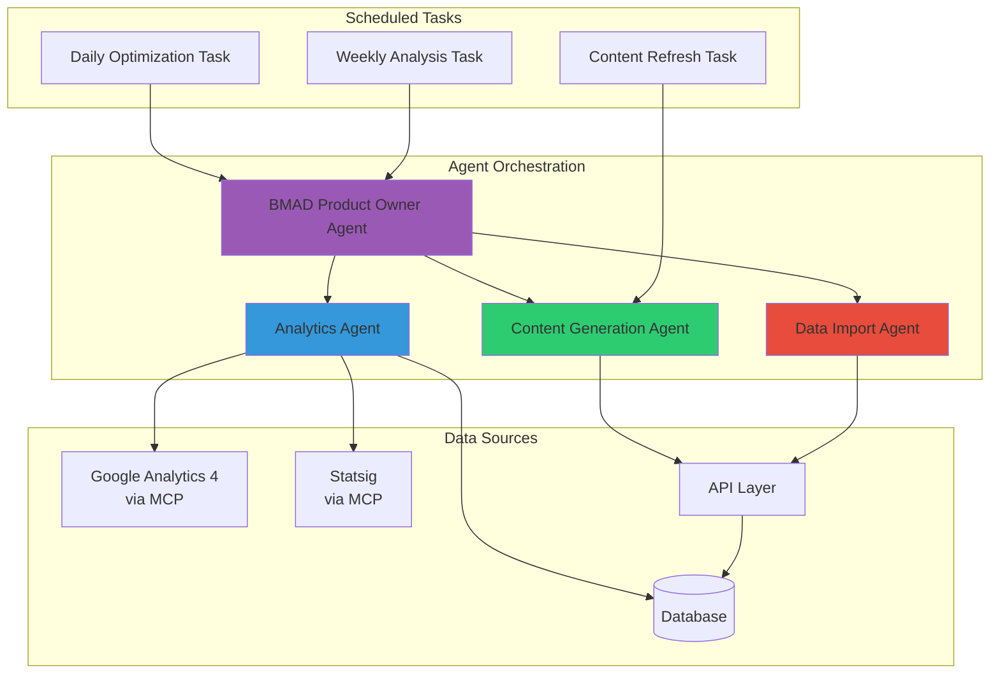

### Scheduled Tasks Infrastructure

#### Task Scheduling Architecture

**Platform:** Vercel Cron Jobs (for serverless scheduled tasks)

**Task Types:**
1. **Daily Optimization Tasks** - Run daily to analyze performance and trigger optimizations
2. **Weekly Analysis Tasks** - Weekly deep-dive analysis and strategy updates
3. **Content Refresh Tasks** - Periodic content freshness updates
4. **Experiment Monitoring Tasks** - Monitor active experiments and analyze results
5. **Data Import Tasks** - Scheduled product data imports

#### Scheduled Task Implementation

**Vercel Cron Configuration:**

```json
// vercel.json
{
  "crons": [
    {
      "path": "/api/cron/daily-optimization",
      "schedule": "0 2 * * *"
    },
    {
      "path": "/api/cron/weekly-analysis",
      "schedule": "0 3 * * 1"
    },
    {
      "path": "/api/cron/content-refresh",
      "schedule": "0 4 * * *"
    },
    {
      "path": "/api/cron/experiment-monitoring",
      "schedule": "*/30 * * * *"
    },
    {
      "path": "/api/cron/data-import",
      "schedule": "0 1 * * *"
    }
  ]
}
```

**Daily Optimization Task:**

```typescript
// app/api/cron/daily-optimization/route.ts
import { NextRequest, NextResponse } from 'next/server';
import { validateCronSecret } from '@/lib/middleware/cron';
import { productOwnerAgent } from '@/lib/agents/product-owner';

export async function GET(request: NextRequest) {
  // Validate cron secret
  const authHeader = request.headers.get('authorization');
  if (!validateCronSecret(authHeader)) {
    return NextResponse.json({ error: 'Unauthorized' }, { status: 401 });
  }

  try {
    // Trigger product owner agent for daily optimization
    await productOwnerAgent.runDailyOptimization();
    
    return NextResponse.json({ 
      success: true,
      message: 'Daily optimization task completed'
    });
  } catch (error) {
    console.error('Daily optimization task failed:', error);
    return NextResponse.json(
      { error: 'Task failed', details: error instanceof Error ? error.message : 'Unknown error' },
      { status: 500 }
    );
  }
}
```

**Weekly Analysis Task:**

```typescript
// app/api/cron/weekly-analysis/route.ts
import { NextRequest, NextResponse } from 'next/server';
import { validateCronSecret } from '@/lib/middleware/cron';
import { productOwnerAgent } from '@/lib/agents/product-owner';

export async function GET(request: NextRequest) {
  const authHeader = request.headers.get('authorization');
  if (!validateCronSecret(authHeader)) {
    return NextResponse.json({ error: 'Unauthorized' }, { status: 401 });
  }

  try {
    // Trigger product owner agent for weekly analysis
    await productOwnerAgent.runWeeklyAnalysis();
    
    return NextResponse.json({ 
      success: true,
      message: 'Weekly analysis task completed'
    });
  } catch (error) {
    console.error('Weekly analysis task failed:', error);
    return NextResponse.json(
      { error: 'Task failed' },
      { status: 500 }
    );
  }
}
```

### Continuous Improvement Workflow

#### Workflow Overview

The continuous improvement cycle follows this pattern:

1. **Data Collection** - GA4 and Statsig collect user behavior and experiment data
2. **Analysis** - Analytics agent queries data and identifies opportunities
3. **Strategy** - Product owner agent analyzes insights and creates optimization strategy
4. **Experimentation** - Product owner agent creates experiments via Statsig
5. **Content Generation** - Content generation agent creates optimized content variations
6. **Monitoring** - Analytics agent monitors experiment performance
7. **Decision** - Product owner agent analyzes results and selects winning variations
8. **Implementation** - Content generation agent implements winning variations
9. **Repeat** - Cycle continues with new data

#### Continuous Improvement Sequence Diagram

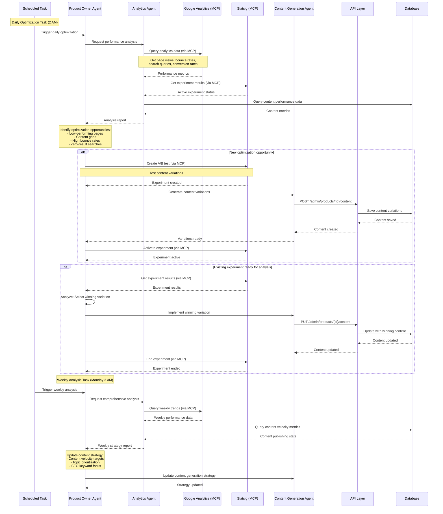

### BMAD Product Owner Agent Implementation

#### Agent Structure

```typescript
// lib/agents/product-owner.ts
import { analyticsAgent } from './analytics';
import { contentGenerationAgent } from './content-generation';
import { statsigMCP } from '@/lib/integrations/statsig';
import { ga4MCP } from '@/lib/integrations/ga4';

export class ProductOwnerAgent {
  /**
   * Daily optimization workflow
   * Analyzes performance data and triggers optimizations
   */
  async runDailyOptimization(): Promise<void> {
    // 1. Get performance analysis
    const analysis = await analyticsAgent.analyzeDailyPerformance();
    
    // 2. Identify optimization opportunities
    const opportunities = this.identifyOpportunities(analysis);
    
    // 3. Prioritize opportunities
    const prioritized = this.prioritizeOpportunities(opportunities);
    
    // 4. Create experiments for top opportunities
    for (const opportunity of prioritized.slice(0, 5)) {
      await this.createOptimizationExperiment(opportunity);
    }
    
    // 5. Check and analyze active experiments
    await this.analyzeActiveExperiments();
  }

  /**
   * Weekly analysis workflow
   * Deep-dive analysis and strategy updates
   */
  async runWeeklyAnalysis(): Promise<void> {
    // 1. Get comprehensive weekly analysis
    const weeklyAnalysis = await analyticsAgent.analyzeWeeklyPerformance();
    
    // 2. Analyze content velocity impact
    const velocityImpact = await this.analyzeContentVelocityImpact();
    
    // 3. Update content strategy
    await this.updateContentStrategy(weeklyAnalysis, velocityImpact);
    
    // 4. Generate weekly report
    await this.generateWeeklyReport(weeklyAnalysis);
  }

  /**
   * Identify optimization opportunities from analysis
   */
  private identifyOpportunities(analysis: PerformanceAnalysis): OptimizationOpportunity[] {
    const opportunities: OptimizationOpportunity[] = [];
    
    // Low-performing pages
    const lowPerformers = analysis.pages.filter(
      p => p.bounceRate > 0.7 || p.avgTimeOnPage < 30
    );
    for (const page of lowPerformers) {
      opportunities.push({
        type: 'content_optimization',
        priority: 'high',
        target: page.id,
        reason: `High bounce rate (${page.bounceRate}) or low engagement`,
        suggestedActions: ['improve_headline', 'enhance_description', 'add_faqs'],
      });
    }
    
    // Content gaps (zero-result searches)
    for (const search of analysis.zeroResultSearches) {
      opportunities.push({
        type: 'content_creation',
        priority: 'medium',
        target: search.query,
        reason: `Zero results for search query: ${search.query}`,
        suggestedActions: ['create_product_page', 'create_guide', 'create_blog_post'],
      });
    }
    
    // High-performing content patterns
    const highPerformers = analysis.pages.filter(
      p => p.conversionRate > analysis.avgConversionRate * 1.2
    );
    if (highPerformers.length > 0) {
      opportunities.push({
        type: 'pattern_replication',
        priority: 'high',
        target: 'multiple',
        reason: 'Identify and replicate high-performing content patterns',
        suggestedActions: ['analyze_patterns', 'apply_to_similar_pages'],
      });
    }
    
    return opportunities;
  }

  /**
   * Create optimization experiment
   */
  private async createOptimizationExperiment(
    opportunity: OptimizationOpportunity
  ): Promise<void> {
    // Create experiment in Statsig
    const experiment = await statsigMCP.createExperiment({
      name: `Optimization: ${opportunity.type} - ${opportunity.target}`,
      description: opportunity.reason,
      variants: ['control', 'variant_a', 'variant_b'],
      metrics: ['page_views', 'bounce_rate', 'time_on_page', 'conversion_rate'],
    });
    
    // Generate content variations
    const variations = await contentGenerationAgent.generateVariations(
      opportunity.target,
      opportunity.suggestedActions
    );
    
    // Assign variations to experiment variants
    await statsigMCP.assignVariations(experiment.id, variations);
    
    // Activate experiment
    await statsigMCP.activateExperiment(experiment.id);
  }

  /**
   * Analyze active experiments and make decisions
   */
  private async analyzeActiveExperiments(): Promise<void> {
    const activeExperiments = await statsigMCP.getActiveExperiments();
    
    for (const experiment of activeExperiments) {
      // Check if experiment has enough data
      if (experiment.sampleSize < experiment.minSampleSize) {
        continue; // Not enough data yet
      }
      
      // Get experiment results
      const results = await statsigMCP.getExperimentResults(experiment.id);
      
      // Analyze results
      const winner = this.determineWinner(results);
      
      if (winner && winner.confidence > 0.95) {
        // Implement winning variation
        await contentGenerationAgent.implementVariation(
          experiment.targetId,
          winner.variation
        );
        
        // End experiment
        await statsigMCP.endExperiment(experiment.id, winner.variation);
      }
    }
  }

  /**
   * Analyze content velocity impact on performance
   */
  private async analyzeContentVelocityImpact(): Promise<ContentVelocityImpact> {
    const velocityData = await analyticsAgent.getContentVelocityMetrics();
    const performanceData = await analyticsAgent.getPerformanceMetrics();
    
    // Correlate content publishing with traffic/engagement
    const correlation = this.calculateCorrelation(velocityData, performanceData);
    
    return {
      correlation,
      optimalPublishingFrequency: this.calculateOptimalFrequency(correlation),
      recommendedContentTypes: this.identifyHighImpactContentTypes(correlation),
    };
  }

  /**
   * Update content strategy based on analysis
   */
  private async updateContentStrategy(
    weeklyAnalysis: WeeklyAnalysis,
    velocityImpact: ContentVelocityImpact
  ): Promise<void> {
    const strategy = {
      contentVelocity: {
        targetDailyPosts: velocityImpact.optimalPublishingFrequency,
        priorityTypes: velocityImpact.recommendedContentTypes,
      },
      seoFocus: {
        keywords: weeklyAnalysis.topPerformingKeywords,
        topics: weeklyAnalysis.highEngagementTopics,
      },
      optimization: {
        focusAreas: weeklyAnalysis.optimizationOpportunities,
        experimentPriorities: weeklyAnalysis.experimentPriorities,
      },
    };
    
    // Store strategy in database
    await prisma.contentStrategy.upsert({
      where: { id: 'current' },
      update: strategy,
      create: { id: 'current', ...strategy },
    });
    
    // Notify content generation agent of strategy update
    await contentGenerationAgent.updateStrategy(strategy);
  }
}

export const productOwnerAgent = new ProductOwnerAgent();
```

### Analytics Agent Implementation

```typescript
// lib/agents/analytics.ts
import { ga4MCP } from '@/lib/integrations/ga4';
import { statsigMCP } from '@/lib/integrations/statsig';
import { prisma } from '@/lib/db/client';

export class AnalyticsAgent {
  /**
   * Analyze daily performance metrics
   */
  async analyzeDailyPerformance(): Promise<PerformanceAnalysis> {
    // Query GA4 for daily metrics
    const ga4Data = await ga4MCP.runReport({
      dateRange: { start: 'yesterday', end: 'today' },
      metrics: ['pageViews', 'bounceRate', 'avgTimeOnPage', 'conversionRate'],
      dimensions: ['pagePath', 'pageTitle'],
    });
    
    // Query database for content metrics
    const contentMetrics = await prisma.productContent.findMany({
      include: {
        product: true,
      },
    });
    
    // Get zero-result searches from GA4
    const zeroResultSearches = await ga4MCP.getZeroResultSearches({
      dateRange: { start: '7daysAgo', end: 'today' },
    });
    
    return {
      pages: ga4Data.rows.map(row => ({
        id: row.pagePath,
        title: row.pageTitle,
        pageViews: parseInt(row.pageViews),
        bounceRate: parseFloat(row.bounceRate),
        avgTimeOnPage: parseFloat(row.avgTimeOnPage),
        conversionRate: parseFloat(row.conversionRate),
      })),
      avgConversionRate: this.calculateAverage(ga4Data.rows, 'conversionRate'),
      zeroResultSearches: zeroResultSearches.map(s => ({
        query: s.query,
        count: s.count,
      })),
      timestamp: new Date(),
    };
  }

  /**
   * Analyze weekly performance trends
   */
  async analyzeWeeklyPerformance(): Promise<WeeklyAnalysis> {
    const ga4Data = await ga4MCP.runReport({
      dateRange: { start: '7daysAgo', end: 'today' },
      metrics: ['pageViews', 'users', 'sessions', 'conversionRate'],
      dimensions: ['pagePath', 'keyword', 'topic'],
    });
    
    // Analyze trends
    const trends = this.analyzeTrends(ga4Data);
    
    // Identify top performing keywords
    const topKeywords = this.getTopPerformingKeywords(ga4Data);
    
    // Identify high engagement topics
    const highEngagementTopics = this.getHighEngagementTopics(ga4Data);
    
    return {
      trends,
      topPerformingKeywords: topKeywords,
      highEngagementTopics,
      optimizationOpportunities: await this.identifyOptimizationOpportunities(ga4Data),
      experimentPriorities: await this.getExperimentPriorities(),
    };
  }

  /**
   * Get content velocity metrics
   */
  async getContentVelocityMetrics(): Promise<ContentVelocityMetrics> {
    const last7Days = await prisma.blogPost.count({
      where: {
        publishedAt: {
          gte: new Date(Date.now() - 7 * 24 * 60 * 60 * 1000),
        },
      },
    });
    
    const last30Days = await prisma.blogPost.count({
      where: {
        publishedAt: {
          gte: new Date(Date.now() - 30 * 24 * 60 * 60 * 1000),
        },
      },
    });
    
    return {
      postsLast7Days: last7Days,
      postsLast30Days: last30Days,
      avgDailyPosts: last7Days / 7,
      contentTypes: await this.getContentTypeDistribution(),
    };
  }
}

export const analyticsAgent = new AnalyticsAgent();
```

### Integration with Statsig and Google Analytics

#### MCP Integration Pattern

**Statsig MCP Connector:**

```typescript
// lib/integrations/statsig.ts
import { mcpClient } from '@/lib/mcp/client';

export class StatsigMCP {
  /**
   * Create A/B test experiment
   */
  async createExperiment(config: ExperimentConfig): Promise<Experiment> {
    return mcpClient.call('statsig/create_experiment', config);
  }

  /**
   * Get active experiments
   */
  async getActiveExperiments(): Promise<Experiment[]> {
    return mcpClient.call('statsig/get_active_experiments', {});
  }

  /**
   * Get experiment results
   */
  async getExperimentResults(experimentId: string): Promise<ExperimentResults> {
    return mcpClient.call('statsig/get_experiment_results', { experimentId });
  }

  /**
   * Activate experiment
   */
  async activateExperiment(experimentId: string): Promise<void> {
    return mcpClient.call('statsig/activate_experiment', { experimentId });
  }

  /**
   * End experiment
   */
  async endExperiment(experimentId: string, winner: string): Promise<void> {
    return mcpClient.call('statsig/end_experiment', { experimentId, winner });
  }
}

export const statsigMCP = new StatsigMCP();
```

**Google Analytics 4 MCP Connector:**

```typescript
// lib/integrations/ga4.ts
import { mcpClient } from '@/lib/mcp/client';

export class GA4MCP {
  /**
   * Run analytics report
   */
  async runReport(config: ReportConfig): Promise<ReportData> {
    return mcpClient.call('ga4/run_report', config);
  }

  /**
   * Get real-time analytics data
   */
  async getRealtimeData(): Promise<RealtimeData> {
    return mcpClient.call('ga4/get_realtime_data', {});
  }

  /**
   * Get zero-result searches
   */
  async getZeroResultSearches(config: DateRangeConfig): Promise<SearchQuery[]> {
    return mcpClient.call('ga4/get_zero_result_searches', config);
  }

  /**
   * Get search query performance
   */
  async getSearchQueryPerformance(config: DateRangeConfig): Promise<SearchPerformance[]> {
    return mcpClient.call('ga4/get_search_query_performance', config);
  }
}

export const ga4MCP = new GA4MCP();
```

### Database Schema Extensions

**Content Strategy Table:**

```prisma
model ContentStrategy {
  id              String   @id @default("current")
  contentVelocity  Json     // Target daily posts, priority types
  seoFocus         Json     // Keywords, topics
  optimization     Json     // Focus areas, experiment priorities
  updatedAt        DateTime @updatedAt
  createdAt        DateTime @default(now())
}

model OptimizationOpportunity {
  id              String   @id @default(uuid())
  type            String   // content_optimization, content_creation, pattern_replication
  priority        String   // high, medium, low
  target          String   // Product ID, query, etc.
  reason          String
  suggestedActions Json    // Array of action types
  status          String   @default("pending") // pending, in_progress, completed, dismissed
  experimentId    String?  // If experiment created
  createdAt       DateTime @default(now())
  updatedAt       DateTime @updatedAt
}

model Experiment {
  id              String   @id @default(uuid())
  statsigId       String   @unique
  name            String
  description     String
  targetId        String   // Product ID, page ID, etc.
  status          String   // active, completed, paused
  variants        Json     // Experiment variants
  winner          String?  // Winning variation
  startedAt       DateTime @default(now())
  endedAt         DateTime?
  createdAt       DateTime @default(now())
  updatedAt       DateTime @updatedAt
}
```

### Key Benefits

**1. Autonomous Operation:**
- System runs continuously without manual intervention
- Agents make data-driven decisions automatically
- Scheduled tasks ensure regular optimization cycles

**2. Continuous Improvement:**
- Daily optimization tasks keep content fresh and optimized
- Weekly analysis ensures strategic alignment
- Experiment-driven optimization validates improvements

**3. Data-Driven Decisions:**
- All optimizations based on real user behavior
- Experiment results validate hypotheses
- Analytics data guides content strategy

**4. Scalability:**
- Agent-based architecture scales with content volume
- Automated workflows handle thousands of products
- Scheduled tasks ensure consistent optimization

**5. BMAD Integration:**
- Product owner agents follow BMAD methodologies
- Structured workflows enable agent collaboration
- Clear separation of concerns (analysis, strategy, execution)

## Unified Project Structure

This section defines the complete monorepo structure for the Online Nursery Ecommerce Website, accommodating both frontend (Next.js) and backend (API routes) in a unified codebase with shared packages.

### Monorepo Structure

```
nursery/
├── .github/                              # CI/CD workflows
│   └── workflows/
│       ├── ci.yaml                       # Continuous integration
│       ├── deploy.yaml                   # Deployment workflow
│       └── pr-checks.yaml                # PR validation
├── .cursor/                              # Cursor IDE configuration
│   └── rules/                            # BMAD rules and workflows
├── apps/                                 # Application packages
│   ├── web/                              # Next.js frontend + API routes
│   │   ├── app/                          # Next.js App Router
│   │   │   ├── (marketing)/              # Marketing route group
│   │   │   │   ├── layout.tsx            # Marketing layout
│   │   │   │   ├── page.tsx              # Homepage
│   │   │   │   ├── products/
│   │   │   │   │   └── [category]/
│   │   │   │   │       └── [slug]/
│   │   │   │   │           └── page.tsx   # Product detail page
│   │   │   │   ├── categories/
│   │   │   │   │   └── [slug]/
│   │   │   │   │       └── page.tsx       # Category page
│   │   │   │   ├── blog/
│   │   │   │   │   ├── page.tsx          # Blog listing
│   │   │   │   │   └── [slug]/
│   │   │   │   │       └── page.tsx       # Blog post page
│   │   │   │   ├── guides/
│   │   │   │   │   ├── page.tsx          # Guides listing
│   │   │   │   │   └── [slug]/
│   │   │   │   │       └── page.tsx       # Guide page
│   │   │   │   ├── compare/
│   │   │   │   │   └── [slug]/
│   │   │   │   │       └── page.tsx       # Product comparison
│   │   │   │   ├── locations/
│   │   │   │   │   └── [slug]/
│   │   │   │   │       └── page.tsx       # Location-specific pages
│   │   │   │   └── search/
│   │   │   │       └── page.tsx          # Search results
│   │   │   ├── api/                      # API routes
│   │   │   │   ├── health/
│   │   │   │   │   └── route.ts          # Health check
│   │   │   │   ├── products/
│   │   │   │   │   ├── route.ts          # GET /api/products
│   │   │   │   │   └── [id]/
│   │   │   │   │       ├── route.ts      # GET /api/products/{id}
│   │   │   │   │       └── content/
│   │   │   │   │           └── route.ts  # Product content endpoints
│   │   │   │   ├── categories/
│   │   │   │   │   ├── route.ts          # GET /api/categories
│   │   │   │   │   └── [id]/
│   │   │   │   │       └── route.ts      # GET /api/categories/{id}
│   │   │   │   ├── search/
│   │   │   │   │   └── route.ts          # GET /api/search
│   │   │   │   ├── blog-posts/
│   │   │   │   │   ├── route.ts          # GET /api/blog-posts
│   │   │   │   │   └── [slug]/
│   │   │   │   │       └── route.ts      # GET /api/blog-posts/{slug}
│   │   │   │   └── admin/                # Admin API routes (agent-accessible)
│   │   │   │       ├── products/
│   │   │   │       │   ├── route.ts      # POST /api/admin/products
│   │   │   │       │   ├── import/
│   │   │   │       │   │   └── route.ts  # POST /api/admin/products/import
│   │   │   │       │   ├── update-incremental/
│   │   │   │       │   │   └── route.ts  # POST /api/admin/products/update-incremental
│   │   │   │       │   ├── generate-content/
│   │   │   │       │   │   └── route.ts  # POST /api/admin/products/generate-content
│   │   │   │       │   └── bulk-content/
│   │   │   │       │       └── route.ts  # POST /api/admin/products/bulk-content
│   │   │   │       ├── blog-posts/
│   │   │   │       │   ├── route.ts      # POST /api/admin/blog-posts
│   │   │   │       │   └── [id]/
│   │   │   │       │       └── route.ts  # PUT/DELETE /api/admin/blog-posts/{id}
│   │   │   │       ├── scraping-jobs/
│   │   │   │       │   ├── route.ts      # GET/POST /api/admin/scraping-jobs
│   │   │   │       │   └── [id]/
│   │   │   │       │       └── route.ts  # GET /api/admin/scraping-jobs/{id}
│   │   │   │       └── analytics/
│   │   │   │           └── search/
│   │   │   │               └── route.ts  # GET /api/admin/analytics/search
│   │   │   ├── layout.tsx                 # Root layout
│   │   │   ├── loading.tsx                # Global loading UI
│   │   │   ├── error.tsx                  # Global error boundary
│   │   │   ├── not-found.tsx              # 404 page
│   │   │   └── globals.css                # Global styles
│   │   ├── components/                    # React components
│   │   │   ├── ui/                        # shadcn/ui components
│   │   │   │   ├── button.tsx
│   │   │   │   ├── input.tsx
│   │   │   │   ├── card.tsx
│   │   │   │   └── ...                   # Other UI components
│   │   │   ├── product/                   # Product-specific components
│   │   │   │   ├── ProductCard.tsx
│   │   │   │   ├── ProductDetail.tsx
│   │   │   │   ├── ProductImage.tsx
│   │   │   │   └── RelatedProducts.tsx
│   │   │   ├── category/                  # Category components
│   │   │   │   ├── CategoryCard.tsx
│   │   │   │   └── CategoryFilter.tsx
│   │   │   ├── search/                    # Search components
│   │   │   │   ├── SearchBar.tsx
│   │   │   │   └── SearchResults.tsx
│   │   │   ├── blog/                      # Blog components
│   │   │   │   ├── BlogCard.tsx
│   │   │   │   └── BlogPost.tsx
│   │   │   ├── layout/                    # Layout components
│   │   │   │   ├── Header.tsx
│   │   │   │   ├── Footer.tsx
│   │   │   │   └── Navigation.tsx
│   │   │   └── seo/                       # SEO components
│   │   │       ├── StructuredData.tsx
│   │   │       └── MetaTags.tsx
│   │   ├── lib/                          # Shared utilities and services
│   │   │   ├── db/
│   │   │   │   └── client.ts             # Prisma client
│   │   │   ├── repositories/             # Data access layer
│   │   │   │   ├── ProductRepository.ts
│   │   │   │   ├── CategoryRepository.ts
│   │   │   │   └── BlogPostRepository.ts
│   │   │   ├── services/                 # Business logic layer
│   │   │   │   ├── ProductService.ts
│   │   │   │   ├── CategoryService.ts
│   │   │   │   ├── ContentValidationService.ts
│   │   │   │   └── SearchService.ts
│   │   │   ├── middleware/               # Middleware functions
│   │   │   │   └── auth.ts               # Authentication middleware
│   │   │   ├── api/                      # API client (for frontend)
│   │   │   │   ├── client.ts             # Base API client
│   │   │   │   ├── products.ts           # Product API service
│   │   │   │   └── categories.ts         # Category API service
│   │   │   ├── utils/                    # Utility functions
│   │   │   │   ├── format.ts
│   │   │   │   ├── validation.ts
│   │   │   │   └── seo.ts
│   │   │   └── hooks/                    # Custom React hooks
│   │   │       ├── useDebounce.ts
│   │   │       └── useSearch.ts
│   │   ├── public/                       # Static assets
│   │   │   ├── images/                  # Static images
│   │   │   ├── icons/                   # Icons
│   │   │   └── favicon.ico
│   │   ├── types/                        # TypeScript type definitions
│   │   │   ├── product.ts
│   │   │   ├── category.ts
│   │   │   └── api.ts
│   │   ├── tests/                        # Test files
│   │   │   ├── unit/
│   │   │   ├── integration/
│   │   │   └── __mocks__/
│   │   ├── middleware.ts                 # Next.js middleware
│   │   ├── next.config.js                # Next.js configuration
│   │   ├── tailwind.config.js            # Tailwind CSS configuration
│   │   ├── tsconfig.json                 # TypeScript configuration
│   │   ├── vitest.config.ts              # Vitest configuration
│   │   └── package.json
│   └── scraper/                          # Scraping service (optional separate app)
│       ├── src/
│       │   ├── scrapers/
│       │   │   └── plantmark.ts          # Plantmark scraper
│       │   ├── services/
│       │   │   └── import.ts             # Data import service
│       │   ├── utils/
│       │   │   └── proxy.ts              # Proxy/VPN utilities
│       │   └── index.ts                  # Entry point
│       ├── tests/
│       ├── tsconfig.json
│       └── package.json
├── packages/                             # Shared packages
│   ├── shared/                           # Shared types and utilities
│   │   ├── src/
│   │   │   ├── types/                    # Shared TypeScript types
│   │   │   │   ├── product.ts
│   │   │   │   ├── category.ts
│   │   │   │   └── api.ts
│   │   │   ├── constants/                # Shared constants
│   │   │   │   ├── product-types.ts
│   │   │   │   └── availability.ts
│   │   │   └── utils/                    # Shared utilities
│   │   │       ├── validation.ts
│   │   │       └── formatting.ts
│   │   ├── tsconfig.json
│   │   └── package.json
│   ├── db/                               # Database package (Prisma)
│   │   ├── prisma/
│   │   │   ├── schema.prisma             # Prisma schema
│   │   │   └── migrations/               # Database migrations
│   │   ├── src/
│   │   │   └── index.ts                  # Re-export Prisma client
│   │   ├── tsconfig.json
│   │   └── package.json
│   ├── api-client/                       # Shared API client for agent use
│   │   ├── src/
│   │   │   ├── client.ts                 # Base API client
│   │   │   ├── products.ts               # Product endpoints
│   │   │   ├── categories.ts             # Category endpoints
│   │   │   └── admin.ts                  # Admin endpoints
│   │   ├── tsconfig.json
│   │   └── package.json
│   └── fulfillment/                      # Fulfillment logic
│       ├── src/
│       │   ├── strategies/               # Fulfillment strategy pattern
│       │   │   ├── DigitalFulfillment.ts
│       │   │   ├── DropshipFulfillment.ts
│       │   │   └── InventoryFulfillment.ts
│       │   ├── FulfillmentService.ts     # Main fulfillment service
│       │   └── types.ts
│       ├── tsconfig.json
│       └── package.json
├── infrastructure/                      # Infrastructure as code
│   ├── vercel.json                       # Vercel configuration
│   ├── supabase/                         # Supabase configuration
│   │   └── migrations/                   # Supabase migrations
│   └── scripts/                          # Deployment scripts
│       ├── deploy.sh
│       └── migrate.sh
├── scripts/                              # Build and utility scripts
│   ├── setup.sh                          # Initial setup script
│   ├── generate-types.ts                 # Type generation script
│   └── seed.ts                           # Database seeding script
├── docs/                                 # Documentation
│   ├── prd.md                            # Product Requirements Document
│   ├── architecture.md                   # This file
│   ├── api/                              # API documentation
│   │   └── openapi.yaml                  # OpenAPI specification
│   └── guides/                           # Development guides
│       ├── setup.md
│       └── contributing.md
├── .env.example                          # Environment variables template
├── .gitignore
├── .eslintrc.json                        # ESLint configuration
├── .prettierrc                           # Prettier configuration
├── package.json                          # Root package.json (workspace config)
├── pnpm-workspace.yaml                   # pnpm workspace config (if using pnpm)
└── README.md                             # Project README
```

### Package Structure Details

#### Root `package.json` (Workspace Configuration)

```json
{
  "name": "nursery",
  "version": "1.0.0",
  "private": true,
  "workspaces": [
    "apps/*",
    "packages/*"
  ],
  "scripts": {
    "dev": "npm run dev --workspace=apps/web",
    "build": "npm run build --workspace=apps/web",
    "test": "npm run test --workspaces",
    "lint": "npm run lint --workspaces",
    "type-check": "npm run type-check --workspaces",
    "db:migrate": "npm run db:migrate --workspace=packages/db",
    "db:generate": "npm run db:generate --workspace=packages/db",
    "db:seed": "tsx scripts/seed.ts"
  },
  "devDependencies": {
    "@types/node": "^20.0.0",
    "typescript": "^5.0.0",
    "prettier": "^3.0.0",
    "eslint": "^8.0.0"
  }
}
```

#### `apps/web/package.json` (Next.js Application)

```json
{
  "name": "@nursery/web",
  "version": "1.0.0",
  "scripts": {
    "dev": "next dev",
    "build": "next build",
    "start": "next start",
    "lint": "next lint",
    "type-check": "tsc --noEmit",
    "test": "vitest",
    "test:ui": "vitest --ui"
  },
  "dependencies": {
    "next": "^14.0.0",
    "react": "^18.0.0",
    "react-dom": "^18.0.0",
    "@nursery/shared": "*",
    "@nursery/db": "*",
    "@nursery/api-client": "*",
    "@nursery/fulfillment": "*",
    "@prisma/client": "^5.0.0",
    "zod": "^3.22.0",
    "tailwindcss": "^3.3.0",
    "lucide-react": "^0.300.0"
  },
  "devDependencies": {
    "@types/react": "^18.0.0",
    "@types/react-dom": "^18.0.0",
    "typescript": "^5.0.0",
    "vitest": "^1.0.0",
    "@testing-library/react": "^14.0.0"
  }
}
```

#### `packages/db/package.json` (Database Package)

```json
{
  "name": "@nursery/db",
  "version": "1.0.0",
  "main": "./src/index.ts",
  "types": "./src/index.ts",
  "scripts": {
    "db:generate": "prisma generate",
    "db:migrate": "prisma migrate dev",
    "db:push": "prisma db push",
    "db:studio": "prisma studio"
  },
  "dependencies": {
    "@prisma/client": "^5.0.0"
  },
  "devDependencies": {
    "prisma": "^5.0.0"
  }
}
```

#### `packages/shared/package.json` (Shared Package)

```json
{
  "name": "@nursery/shared",
  "version": "1.0.0",
  "main": "./src/index.ts",
  "types": "./src/index.ts",
  "scripts": {
    "type-check": "tsc --noEmit"
  },
  "dependencies": {
    "zod": "^3.22.0"
  },
  "devDependencies": {
    "typescript": "^5.0.0"
  }
}
```

### Key Structural Decisions

**1. Monorepo Organization:**
- **Apps:** Deployable applications (`web`, `scraper`)
- **Packages:** Shared code libraries (`shared`, `db`, `api-client`, `fulfillment`)
- **Clear separation:** Apps depend on packages, packages don't depend on apps

**2. Next.js App Router Structure:**
- **Route groups:** `(marketing)` for grouping routes without affecting URLs
- **API routes:** Co-located with frontend in `app/api/`
- **Components:** Organized by feature/domain (product, category, search, etc.)

**3. Shared Code Organization:**
- **Types:** Shared TypeScript types in `packages/shared`
- **Database:** Prisma schema and client in `packages/db`
- **API Client:** Reusable API client for agents in `packages/api-client`
- **Business Logic:** Fulfillment strategies in `packages/fulfillment`

**4. Testing Structure:**
- **Unit tests:** Co-located with source files or in `tests/unit/`
- **Integration tests:** In `tests/integration/`
- **E2E tests:** Deferred to Phase 2

**5. Configuration Files:**
- **Root level:** Workspace configuration, shared tooling configs
- **App level:** Next.js, TypeScript, Tailwind configs specific to the app
- **Package level:** Package-specific configurations

### Development Workflow

**Local Development:**
```bash
# Install dependencies
npm install

# Generate Prisma client
npm run db:generate

# Run database migrations
npm run db:migrate

# Start development server
npm run dev

# Run tests
npm test

# Type check
npm run type-check
```

**Building:**
```bash
# Build all packages
npm run build --workspaces

# Build specific app
npm run build --workspace=apps/web
```

**Database Operations:**
```bash
# Create migration
npm run db:migrate --workspace=packages/db

# Seed database
npm run db:seed
```

This structure supports:
- **Scalability:** Easy to add new apps or packages
- **Code Sharing:** Shared types, utilities, and business logic
- **Type Safety:** Full TypeScript support across packages
- **Agent-Friendly:** Clear API boundaries for agent access
- **SEO Optimization:** Next.js App Router structure optimized for SSR/SSG

